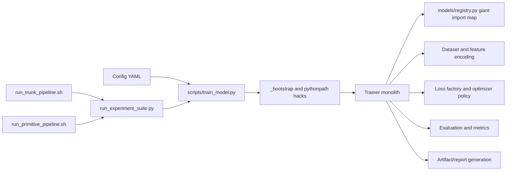
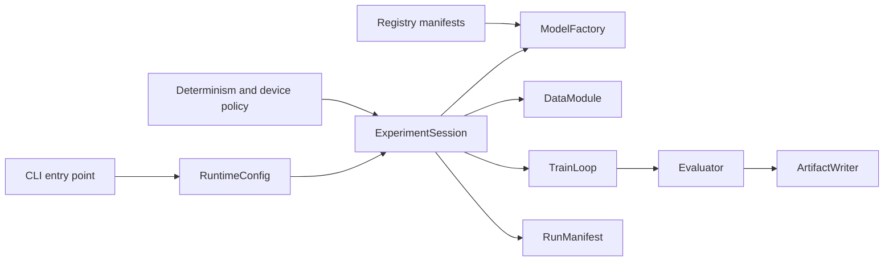

# Engineering Audit of LenniAConrad Chess NN Playground

## Executive summary

**Enabled connector used for repository inspection:** GitHub.

`LenniAConrad/chess-nn-playground` already has some unusually strong research-process assets for a personal or experimental ML repository: a documented repo layout, a documented script surface, explicit artifact contracts, static config validation, smoke tests, and benchmark-contract tests. Those are real strengths, and they mean the project is not a “blank slate.” fileciteturn58file0L1-L3 fileciteturn67file0L1-L3 fileciteturn39file0L1-L3 fileciteturn45file0L1-L3 fileciteturn46file0L1-L3 fileciteturn50file0L1-L3 fileciteturn51file0L1-L3

The core problem is that the repository’s **engineering center of gravity is wrong**. The training runtime is concentrated in a single large `Trainer` object that mixes config normalization, device policy, dataset construction, model/loss factory selection, training, evaluation, metrics, artifact generation, reporting, and CUDA-OOM fallback; meanwhile `models/registry.py` is a giant hard-coded import-and-alias registry for a very large number of architectures. This combination makes the codebase fragile, slow to reason about, hard to extend safely, and increasingly merge-conflict-prone. Before adding more features or widening the test matrix, the highest-leverage work is to **re-architect the trainer, replace the registry mechanism, and clean up build/package/CI hygiene**. fileciteturn52file0L1-L3 fileciteturn53file0L1-L3 fileciteturn54file0L1-L3 fileciteturn55file0L1-L3 fileciteturn56file0L1-L3 fileciteturn31file0L1-L3 fileciteturn35file0L1-L3 fileciteturn37file0L1-L3 fileciteturn38file0L1-L3

Repository hygiene is also materially behind where the code’s ambition suggests it should be. `pyproject.toml` is minimal, with no declared runtime dependencies or console entry points; `requirements.txt` is unpinned and mixes runtime and developer needs; scripts bypass packaging by mutating `sys.path`; Linux/tmux/NVIDIA-oriented shell wrappers perform on-host package installation and dynamic CUDA wheel resolution; and no CI workflow surfaced during repository inspection. I also did not find a `LICENSE`, `CONTRIBUTING.md`, or `CODEOWNERS` file during connector inspection, so licensing and contributor governance are effectively unspecified in the inspected tree. fileciteturn66file0L1-L3 fileciteturn65file0L1-L3 fileciteturn48file0L1-L3 fileciteturn64file0L1-L3 fileciteturn41file0L1-L3 fileciteturn67file0L1-L3

My overall recommendation is to **pause net-new architecture work and most net-new tests** after only the most necessary bug fixes, then do a short but disciplined foundation pass in this order: packaging metadata and entry points, CI and pre-commit, trainer decomposition, registry redesign, then scalable dataset I/O. That ordering reduces risk fastest and prevents the current test surface from calcifying around brittle internals. PyPA’s `src`-layout guidance, `pyproject.toml` metadata spec, GitHub’s Python CI documentation, PyTorch’s reproducibility notes, and Arrow/PyTorch data-loading docs all support this direction. citeturn7view0turn11view0turn11view1turn11view2turn11view3turn11view4turn12view0turn19view0turn19view1turn19view2turn19view3turn20view0turn20view2turn15view0turn15view1turn16view2

## Repository profile and analytical lens

The repository documents an intended separation between importable package code under `src/`, tests, benchmark configs, scripts, data, results, reports, and idea folders. The docs are not hand-wavy; they explicitly define path stability rules, artifact expectations, and script entry points. That improves auditability and onboarding relative to many research repos. The problem is that several implementation choices undercut those stated design goals. fileciteturn71file0L1-L3 fileciteturn58file0L1-L3 fileciteturn67file0L1-L3

The most important unspecified context is operational context. The target deployment environment is **unspecified** in the inspected files: it is not clear whether this repository is intended only for one maintainer’s Linux workstation, for a small research team, or for broader open-source distribution. That matters because many current design choices only make sense for the first case. The shell runners assume `tmux`, Linux package managers, local virtualenv management, and NVIDIA GPU visibility, while the docs position the project as a reproducible experiment harness. fileciteturn41file0L1-L3 fileciteturn40file0L1-L3 fileciteturn42file0L1-L3 fileciteturn71file0L1-L3



The current flow is usable, but almost every arrow is a coupling point: text-based subprocess coordination, mutable path bootstrapping, hard-coded model registration, and artifact/report production inside the same runtime object. That is the key structural issue behind most other findings. fileciteturn17file0L1-L3 fileciteturn48file0L1-L3 fileciteturn57file0L1-L3 fileciteturn41file0L1-L3 fileciteturn42file0L1-L3

## Detailed findings mapped to files and modules

### Structure, modularity, naming, and API design

The training core is a **god object**. Across the inspected ranges of `src/chess_nn_playground/training/trainer.py`, `Trainer.__init__` normalizes config, chooses device policy, resolves output directories, instantiates datasets, builds the model, estimates complexity, selects among many losses, creates optimizer and scheduler, and loads checkpoints; later methods also perform epoch training, evaluation, metric aggregation, artifact generation, report generation, run metadata emission, and CPU fallback after CUDA OOM. This is too much responsibility for one class, and it guarantees that any change to training logic can ripple into evaluation, reporting, checkpointing, or runtime policy. fileciteturn52file0L1-L3 fileciteturn53file0L1-L3 fileciteturn54file0L1-L3 fileciteturn55file0L1-L3 fileciteturn56file0L1-L3

`src/chess_nn_playground/models/registry.py` is another structural bottleneck. It imports a very large set of model builder functions up front and then maintains a giant `MODEL_BUILDERS` dictionary plus aliases and extra registration loops. This will increase import time, enlarge blast radius for syntax/import errors, create chronic merge conflicts, and make the public API a fragile string namespace rather than a composable registration mechanism. It also encourages architecture growth through copy-and-register patterns instead of constrained abstractions. fileciteturn31file0L1-L3 fileciteturn35file0L1-L3 fileciteturn36file0L1-L3 fileciteturn37file0L1-L3 fileciteturn38file0L1-L3

The repository nominally uses a `src/` layout, but it undermines its own packaging discipline. PyPA documents that `src` layout helps prevent accidental use of the in-development copy of the code and makes it more likely you test the installed package rather than the working tree. Here, `_bootstrap.py` inserts both `src` and the repository root into `sys.path`, `scripts/dev/train_cnn.py` adds an extra `sys.path` mutation, and `pyproject.toml` configures pytest with `pythonpath = ["src", "."]`. In other words, the repo adopts `src` layout and then bypasses its main safety benefit. fileciteturn48file0L1-L3 fileciteturn64file0L1-L3 fileciteturn66file0L1-L3 citeturn7view0turn11view3

The orchestration API is also more brittle than it first appears. `scripts/run_experiment_suite.py` launches subprocesses instead of using a library boundary, and it extracts the produced run directory by scraping stdout for the marker `"Saved run to "`. That is a primitive contract: any harmless logging change can break the suite runner. This is an anti-pattern when the repository already owns both caller and callee and could simply return a structured artifact path or write a machine-readable run manifest. fileciteturn57file0L1-L3

### Data flow, performance, and reproducibility

The training stack itself acknowledges memory pressure risks, and the present design amplifies them. `validate_training_config` warns that `data.cache_features=true` can use a lot of RAM and that enabling loader workers with feature caching can duplicate cached tensors across worker processes. The trainer then constructs standard `DataLoader`s with configurable `num_workers`, `persistent_workers`, and `prefetch_factor`, and later evaluation builds a full in-memory `rows` list before materializing complete Parquet predictions for each split and re-reading some of those files again to build plots. That is workable for benchmark-scale experiments, but it is not a scalable design for large dataset growth. fileciteturn39file0L1-L3 fileciteturn54file0L1-L3 fileciteturn55file0L1-L3

The current CUDA-OOM behavior is especially risky for claims of benchmark rigor. `train_from_config` catches CUDA OOM, prints a warning, mutates the config to CPU mode, disables mixed precision and TF32, increases CPU worker settings, sets a heap cap, and then retries training on CPU. PyTorch’s reproducibility notes are explicit that fully reproducible results are not guaranteed across releases, platforms, or CPU vs GPU even with identical seeds, and deterministic controls must be configured deliberately. An automatic CPU retry may be convenient for not wasting work, but it is a poor default for benchmark code because it silently changes the execution regime. This should be opt-in, not implicit. fileciteturn56file0L1-L3 citeturn19view0turn19view1

The data layer should also be redesigned for growth. PyTorch explicitly supports `IterableDataset` for settings where random reads are expensive or improbable, and its data docs discuss worker duplication and randomness in multi-process loading. Apache Arrow’s dataset API is designed for larger-than-memory, multi-file tabular data with projection, predicate pushdown, and parallel reading. For a Parquet-heavy chess benchmark repository, that is a better long-term substrate than a trainer that assumes fully materialized split tables and optional feature caches in Python process memory. citeturn19view2turn19view3turn20view0turn20view1turn20view2

There is also a privacy/security hygiene concern in artifact generation. `utils/env.py` collects Python version, installed package status, CUDA details, visible mount points, and git commit, and the trainer writes environment and run metadata into every run directory. If run artifacts are ever shared outside the maintainer’s machine, mount-point information and environment shape may reveal more host-specific context than necessary. That does not look catastrophic, but it is unnecessary exposure. fileciteturn72file0L1-L3 fileciteturn54file0L1-L3

### Tests, CI, packaging, and contributor hygiene

The repository has **real tests**, and that is worth emphasizing. `tests/test_config_validation.py` checks split validity and required labels; `tests/test_training_smoke.py` exercises tiny end-to-end runs and validates emitted artifacts; `tests/test_benchmark_contracts.py` statically validates config families and model diagnostics against explicit contracts; and `scripts/validate_run_artifacts.py` codifies a concrete artifact set. This is stronger than many ML repos that only test helper functions. fileciteturn45file0L1-L3 fileciteturn50file0L1-L3 fileciteturn46file0L1-L3 fileciteturn51file0L1-L3

But the test surface is uneven and somewhat brittle. `run_primitive_pipeline.sh` discovers primitive tests via a long explicit filename list plus filename-pattern heuristics, which means test discoverability depends on shell-script maintenance rather than pytest markers or directory structure. Separately, `tests/test_benchmark_contracts.py` hard-codes a canonical split directory and an `IDEA_CONTRACTS` mapping with a fixed count of 17 items, which is useful as a content contract today but couples the suite tightly to the repository’s current idea inventory. That is likely to create friction as ideas grow, move, or are retired. Coverage thresholds and branch-coverage enforcement are also unspecified in the inspected repo. fileciteturn42file0L1-L3 fileciteturn46file0L1-L3

Packaging is under-specified. `pyproject.toml` only declares build system, basic project metadata, pytest options, and setuptools package discovery. It does **not** declare runtime dependencies, optional developer dependencies, readme metadata, license metadata, classifiers, project URLs, or console scripts. PyPA’s `pyproject.toml` spec and guide explicitly support those fields. In practice, the repo compensates with an unpinned `requirements.txt` and path-bootstrapping scripts, which means the package is not the authoritative source of install metadata. fileciteturn66file0L1-L3 fileciteturn65file0L1-L3 citeturn11view0turn11view1turn11view2turn11view3turn11view4

Reproducible environment management is also weak. `requirements.txt` pins nothing. `run_trunk_pipeline.sh` strips `torch` out of `requirements.txt`, installs other packages, then tries multiple CUDA-specific PyTorch indexes dynamically and can even auto-install missing OS packages with `apt`, `dnf`, `yum`, `pacman`, or `zypper`. That is clever operationally, but it is the opposite of hermetic CI/CD and makes results depend on host state and install-time network resolution. No GitHub Actions workflow surfaced during inspection, despite GitHub documenting a straightforward path for building and testing Python projects in `.github/workflows`. fileciteturn65file0L1-L3 fileciteturn41file0L1-L3 citeturn12view0

Contributor and governance hygiene lag behind the code’s complexity. I did not find a `CONTRIBUTING.md`, `CODEOWNERS`, or `LICENSE` file during connector inspection. GitHub documents that `CONTRIBUTING.md` improves contributor discoverability and saves time on malformed issues and pull requests, while `CODEOWNERS` provides ownership and review routing. The absence of both is manageable for a solo project, but not if the repo is intended to scale beyond one maintainer. Meanwhile, `.gitignore` is well-curated and does exclude `.env`, key files, data, results, and many generated artifacts, which is a positive signal. fileciteturn60file0L1-L3 citeturn13view0turn13view1turn13view2

One committed automation script deserves special attention: `run_primitive_implementation_with_claude.sh` defaults `CLAUDE_PERMISSION_MODE` to `bypassPermissions` and instructs the agent to “work with the current dirty tree.” Even if this is only for the maintainer’s local use, it normalizes risky automation defaults inside the main repository and mixes research code with agent-ops code. That should be isolated behind safer defaults or moved out of the main code path entirely. fileciteturn63file0L1-L3

## Suggested reimplementations and refactors

The most important refactors are not cosmetic. They are structural replacements for current primitives that are already limiting maintainability.

| Concern | Current state | Recommended reimplementation | Alternative | Recommendation |
|---|---|---|---|---|
| Training runtime | `Trainer` owns nearly everything | Split into `RuntimeConfig`, `ExperimentSession`, `ModelFactory`, `TrainLoop`, `Evaluator`, `ArtifactWriter`, `RuntimePolicy` | Adopt Lightning only for orchestration | Internal decomposition first |
| Model registration | Giant eager import registry | Decorator or manifest-based lazy registry per model module/family | Entry-point/plugin registry | Manifest + lazy import |
| Data access | In-memory split handling plus optional feature cache | Arrow-backed dataset layer with thin map/iterable adapters | Stay on pandas but add memory mapping and chunking | Arrow-backed layer |
| CLI and scripts | `sys.path` bootstrapping and subprocess orchestration | Real `project.scripts` entry points with importable library commands | Keep scripts but remove path hacks | Entry points |

The trainer split should create only a few stable seams. `RuntimeConfig` should validate and normalize once. `ModelFactory` should only build models and losses. `TrainLoop` should only optimize. `Evaluator` should only compute metrics and predictions. `ArtifactWriter` should only write and visualize artifacts. `RuntimePolicy` should own device/determinism/fallback policy. That decomposition keeps new architectures from requiring edits across unrelated concerns. fileciteturn52file0L1-L3 fileciteturn53file0L1-L3 fileciteturn54file0L1-L3 fileciteturn55file0L1-L3 fileciteturn56file0L1-L3

For the registry, I would **not** keep extending `MODEL_BUILDERS`. The most practical redesign is a family-level manifest or decorator registry with lazy imports. For example, each model module can export a builder decorated with `@register_model("slug")`, and the registry package can import only family-level manifests instead of every single model implementation. If long term you want external plugins, PyPA’s entry-point mechanism is already modeled in `pyproject.toml`, but that is a second step, not the first. fileciteturn35file0L1-L3 fileciteturn37file0L1-L3 fileciteturn38file0L1-L3 citeturn11view3

For data I/O, a better design is an Arrow dataset abstraction that can yield row groups, projected columns, and filtered subsets, with a small adapter layer exposing either map-style or iterable-style PyTorch datasets depending on the access pattern. That aligns with PyTorch’s dataset model and Arrow’s support for larger-than-memory multi-file data. It also positions the repository to scale without multiplying Python-process memory or repeatedly reloading whole Parquet files for plotting. citeturn19view2turn19view3turn20view0turn20view1turn20view2



## Prioritized remediation plan

The sequence matters more than the individual items.

| Priority | Action | Effort | Risk | Why before more features/tests |
|---|---|---:|---|---|
| Immediate | Make package metadata authoritative: fill out `[project]`, add dependency groups, add console scripts, stop relying on `sys.path` hacks | Small | Low | Prevents false-success local runs and enables sane CI |
| Immediate | Add CI for lint + unit/smoke tests + artifact validation on CPU | Medium | Low | Stops regressions while refactors happen |
| Immediate | Add `LICENSE`, `CONTRIBUTING.md`, `CODEOWNERS`, issue/PR templates | Small | Low | Clarifies governance before the repo gets busier |
| Near-term | Decompose `Trainer` into runtime modules | Large | High | This is the main architecture bottleneck |
| Near-term | Replace giant registry with lazy manifest/decorator registration | Medium | Medium | Reduces coupling and merge conflicts |
| Near-term | Remove implicit CPU fallback for benchmark runs or make it opt-in and explicitly labeled | Small | Medium | Preserves benchmark integrity |
| Mid-term | Replace split loading path with Arrow-backed data module | Large | Medium | Solves scale and memory pressure |
| Mid-term | Isolate agent/Claude automation scripts from the main engineering path | Small | Medium | Reduces operational/security surprise |

A realistic gate would be: **do not add new model families until the first five rows are complete**. Adding architectures before that will mostly deepen the registry/trainer problem and force more brittle tests to be written against unstable internal seams. fileciteturn35file0L1-L3 fileciteturn52file0L1-L3 fileciteturn53file0L1-L3

## Recommended CI, tests, linters, and sample config

GitHub’s Python Actions docs explicitly support building and testing Python projects in workflows under `.github/workflows/`. Ruff’s docs position it as a fast linter and formatter with `pyproject.toml` support; pre-commit is designed to run hooks before code review; pytest emphasizes auto-discovery and fixtures; and coverage.py supports branch coverage and multiple report formats. That stack is a very good fit for this repository. citeturn12view0turn15view0turn15view1turn16view1turn16view2turn16view3

```yaml
# .github/workflows/ci.yml
name: ci

on:
  push:
  pull_request:

jobs:
  lint-and-test:
    runs-on: ubuntu-latest
    strategy:
      matrix:
        python-version: ["3.10", "3.11", "3.12"]

    steps:
      - uses: actions/checkout@v4

      - uses: actions/setup-python@v5
        with:
          python-version: ${{ matrix.python-version }}

      - name: Install package and dev tools
        run: |
          python -m pip install --upgrade pip
          pip install -e ".[dev]"

      - name: Lint
        run: |
          ruff check .
          ruff format --check .

      - name: Unit and smoke tests
        run: |
          pytest -m "not gpu and not slow" \
            --cov=chess_nn_playground \
            --cov-branch \
            --cov-report=term-missing

      - name: Artifact contract smoke
        run: |
          pytest tests/test_training_smoke.py -q
```

```toml
# pyproject.toml excerpt
[project]
name = "chess-nn-playground"
version = "0.1.0"
description = "Foundational research environment for chess neural network experiments."
readme = "README.md"
requires-python = ">=3.10"
license = "MIT"
dependencies = [
  "numpy>=1.26,<3",
  "pandas>=2.2,<3",
  "pyarrow>=16,<25",
  "python-chess>=1.999",
  "pyyaml>=6,<7",
  "scikit-learn>=1.5,<2",
  "tqdm>=4.66,<5",
  "matplotlib>=3.9,<4",
]

[project.optional-dependencies]
dev = [
  "pytest>=8,<9",
  "pytest-cov>=5,<7",
  "ruff>=0.14,<0.15",
  "pre-commit>=4,<5",
]

[project.scripts]
chess-nn-train = "chess_nn_playground.cli.train:main"
chess-nn-validate-config = "chess_nn_playground.cli.validate_config:main"
chess-nn-validate-run = "chess_nn_playground.cli.validate_run:main"

[tool.pytest.ini_options]
testpaths = ["tests"]
addopts = "-ra"
markers = [
  "slow: long-running tests",
  "gpu: requires CUDA",
  "integration: cross-module integration tests",
]

[tool.coverage.run]
branch = true
source = ["chess_nn_playground"]

[tool.coverage.report]
show_missing = true
skip_covered = true

[tool.ruff]
line-length = 100

[tool.ruff.lint]
select = ["E", "F", "I", "B", "UP", "SIM"]
```

```yaml
# .pre-commit-config.yaml
repos:
  - repo: https://github.com/astral-sh/ruff-pre-commit
    rev: v0.14.0
    hooks:
      - id: ruff-check
        args: [--fix]
      - id: ruff-format

  - repo: https://github.com/pre-commit/pre-commit-hooks
    rev: v5.0.0
    hooks:
      - id: check-yaml
      - id: end-of-file-fixer
      - id: trailing-whitespace
```

For tests, I would keep the current contract philosophy but reorganize the suite into clearer layers: fast unit tests around config/model factories, deterministic smoke tests for trainer/evaluator/artifact contracts, marker-based slow/gpu suites, and a very small number of benchmark-contract tests. The current primitive-shell discovery logic should be replaced by pytest markers so new tests do not require shell-script edits. fileciteturn42file0L1-L3 fileciteturn46file0L1-L3 fileciteturn50file0L1-L3 citeturn16view0turn16view1

## Checklist before adding new features or tests

- `pyproject.toml` fully declares runtime and dev metadata.
- CLI entry points exist; no script mutates `sys.path`.
- CI runs on every PR and is green for lint, unit tests, smoke tests, and artifact validation.
- The trainer has been split so model authors do not edit evaluation/reporting/runtime-policy code.
- The model registry no longer requires a giant central import map.
- CPU fallback is opt-in or explicitly labeled non-benchmark mode.
- Test discovery is marker-based, not shell-script filename enumeration.
- Coverage is measured with branch coverage and enforced for changed code.
- `LICENSE`, `CONTRIBUTING.md`, and `CODEOWNERS` exist.
- Agent/automation scripts use safe defaults or are moved out of the main engineering path.
- The supported OS/GPU/runtime matrix is documented.
- Target release/distribution model remains explicit; if PyPI publishing is not planned, state that clearly.

## Open questions and limitations

This audit focused on the repository harness, packaging, tests, and operational design rather than exhaustively inspecting every model implementation file. That was intentional: the current highest-risk flaws are in shared infrastructure, not any one architecture. Several absence findings are therefore phrased conservatively as “not found during connector inspection” rather than absolute claims. Target deployment environment, intended contributor model, and external distribution target were also unspecified in the inspected materials, so some recommendations are necessarily conditioned on whether the repository is meant to remain a solo research playground or become a reusable/public engineering project.