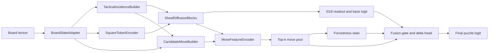

# Candidate Move Forcedness Sheaf

Filename: `i251_candidate_move_forcedness_sheaf.md`

**Thesis.** The strongest next step is not to replace i018’s oriented tactical sheaf, but to wrap it with a **small, deterministic candidate-move bottleneck** that explicitly asks: *does this position contain one move whose local structural evidence sharply dominates the alternatives?* i018 already gives a strong board-only prior by canonicalizing to side to move, building a 12-relation tactical incidence complex, diffusing square states with learned sheaf restriction maps, and reading out pooled sheaf energies and tactical statistics. The new branch should therefore reuse i018’s square states, relation masks, and sheaf diagnostics, enumerate a bounded move graph from the same board tensor, score each candidate with chess-specific features plus local sheaf tension, and pool only the top candidates into an additive residual logit. That design stays board-only, stays sheaf-centered, and is directly falsifiable by shuffling candidate move edges while leaving the static sheaf graph untouched. fileciteturn12file0L3-L3 fileciteturn16file0L3-L3 fileciteturn40file0L3-L3

This direction also fits the repository’s current evidence. i018’s own thesis file reports a paper-grade baseline of **0.8752 ± 0.0045** test PR-AUC and shows that a degree-preserving relation-scramble falsifier drops the family to **0.8328**, which is strong evidence that real chess geometry is carrying signal. The same file reports that several **small gated-logit hybrid grafts** on top of i018 improve test PR-AUC by about **+0.0056 to +0.0065**, so an additive move branch is consistent with the repo’s best-performing integration style rather than a departure from it. fileciteturn16file0L3-L3

## Why i018 misses forcedness

The current i018 pipeline is excellent at describing **static tactical pressure**, but it is not organized around **candidate alternatives**. After side-to-move canonicalization, i018 builds dense typed relation masks over the 64 squares, encodes square tokens, applies two sheaf diffusion blocks, optionally pools triad defects, and then classifies from pooled node summaries, relation-energy summaries, relation densities, relation gates, triad statistics, and coarse board statistics. In other words, the readout is a summary of *where tension lives on the board*; it does **not** contain an explicit bottleneck over *which move, among the available moves, is forcing*. That is the core representational gap. fileciteturn12file0L3-L3 fileciteturn13file0L3-L3

i018’s own math thesis already points at the failure mode. It explicitly notes that non-puzzle positions can still exhibit high tactical tension and that “blunder-rich” non-puzzles may light up the same static incidence patterns as true puzzles. That is exactly the scenario where near-puzzle false positives survive: the board looks tactically charged, but the position lacks a uniquely compelling move bottleneck. A move-branch is therefore not a generic add-on; it is a targeted repair for a failure mode the i018 thesis itself acknowledges. fileciteturn16file0L3-L3

Empirically, i018 is strong enough that the problem is worth solving *inside* the family rather than abandoning it. In the matched-recall audit, i018 ranked third by lowest near-puzzle false-positive rate at both recall **0.80** and **0.85**, with near-FP rates of **0.150** and **0.186** respectively. But its weakest slices at recall 0.80 still included `equal` eval-bucket accuracy **0.743**, `hard` accuracy **0.769**, `mate_in_1` accuracy **0.775**, `very_hard` accuracy **0.795**, and `promotion` accuracy **0.801**. On the promotion and underpromotion near-negative audit, i018 posted a near-FP rate of **0.129**, behind stronger rejection models such as i024 at **0.094**. Those numbers are consistent with a model that sees tactical heat but still under-models *forcedness*. fileciteturn20file0L3-L3

The repo already has adjacent research that reinforces this diagnosis. The `local_move_landscape` handoff packet argues that puzzle-likeness may live in the **distribution of one-ply pseudo-legal consequences**, not only in the current board, and proposes a central falsifier that preserves move counts and source identities while permuting destinations. Separately, the reply-channel-capacity and witness-counterwitness primitives both frame puzzle-like positions in terms of **candidate bottlenecks** and **surviving lines**. i251 should therefore be understood as a synthesis: keep i018’s strong static sheaf, then add the smallest explicit candidate bottleneck that the repo’s other packets are already pointing toward. fileciteturn40file0L3-L3 fileciteturn37file0L3-L3 fileciteturn38file0L3-L3

## Candidate scoring and pooling

The mathematical object should be a **set-valued move bottleneck** attached to the i018 trunk. Let i018 produce final square states \(h_v \in \mathbb{R}^d\), a board context \(r\), and sheaf diagnostics \(u\). Let the move builder return a bounded candidate set
\[
M(x)=\{m_j=(s_j,t_j,\tau_j)\}_{j=1}^{n_x},
\]
where \(s_j\) and \(t_j\) are source and target squares and \(\tau_j\) is a typed move label. For each move, define a deterministic feature vector \(f_j\) and a local sheaf summary \(\psi_j\). The shared move encoder is
\[
z_j = \phi\!\big([h_{s_j},\, h_{t_j},\, h_{t_j}-h_{s_j},\, f_j,\, \psi_j,\, P r]\big),
\]
followed by a scalar move score
\[
a_j = w^\top z_j + b.
\]
This is the smallest move-aware extension that still looks like the repo’s current models: one shared board trunk, one shared per-move encoder, and one permutation-invariant pooling step. Deep Sets gives the correct invariance bias for unordered move sets, while sparse attention mechanisms such as sparsemax or entmax justify converting scores into a **small active support** rather than a dense weight over every candidate. fileciteturn12file0L3-L3 citeturn10view0turn10view1turn8academia2

The pooling should be **top-k and sparse by construction**, not a generic move-policy transformer. Let \(S=\mathrm{TopK}(a,k)\) with a small \(k\) such as 8. On that support, either use a simple softmax or preferably a sparse normalization:
\[
\alpha = \mathrm{sparsemax}(a_S/\tau)
\quad\text{or}\quad
\alpha = \mathrm{softmax}(a_S/\tau).
\]
Then form
\[
m_{\text{pool}}=\sum_{j\in S}\alpha_j z_j,
\qquad
H=-\sum_{j\in S}\alpha_j\log(\alpha_j+\epsilon),
\qquad
g=a_{(1)}-a_{(2)}.
\]
The final puzzle logit is a **gated residual** on top of i018:
\[
\ell_{\text{final}}
=
\ell_{\text{i018}}
+
\sigma(\eta^\top[r,H,g,p_1])\cdot
\delta([m_{\text{pool}},H,g,p_1,u]).
\]
This makes the move branch interpretable, bounded, and easy to ablate: if the move branch adds real signal, it should disappear under target shuffles or feature removals; if it does not, the i018 baseline remains intact. The repo’s existing WCQ math note already uses this exact “base logit plus gated delta” template for candidate-side add-ons, so the fusion rule is stylistically aligned with current practice. fileciteturn38file0L3-L3 fileciteturn16file0L3-L3

A lightweight **forcedness head** should be present, but not over-privileged in v1. The safest first version is diagnostic-only: export `candidate_entropy`, `candidate_top1_mass`, `candidate_gap`, `check_mass`, `promotion_mass`, and `pin_mass`, then let the main BCE loss decide whether the move pool is useful. That mirrors the repo’s current habit of exposing mechanism diagnostics in `predictions_<split>.parquet` without forcing them into the objective. If a second pass is needed, the natural upgrade path is to attach a tiny candidate/reply sub-branch on top of only the top few candidates and reuse the repo’s reply-channel-capacity or witness-counterwitness operators there, but that should be a **follow-on ablation**, not the opening implementation. fileciteturn12file0L3-L3 fileciteturn24file0L3-L3 fileciteturn37file0L3-L3 fileciteturn38file0L3-L3

## Deterministic move-edge construction

The move builder should be deterministic and should **reuse i018’s canonical frame and geometry masks**. i018 already rotates and color-swaps the board so that the mover’s pieces are always seen from the bottom, and its incidence builder already carries precomputed knight, king, king-zone, rook-ray, bishop-ray, queen-ray, pawn, and between-square blocker masks. That means candidate generation can inherit the same simplifications: forward pawn motion is always “up” in canonical space, line visibility is already available, and pin-candidate structure already exists in the trunk. This is exactly the kind of reuse that preserves i018 compatibility instead of bolting on an unrelated move module. fileciteturn12file0L3-L3 fileciteturn13file0L3-L3

The builder should support two modes. The **default scout mode** should be `pseudo_legal`, because the repo’s own move-landscape packet explicitly treats pseudo-legal generation as the conservative engine-free boundary and warns against smuggling in full legality or mate/stalemate oracles. The **promotion mode** should be `legal_light`, which is still board-only and search-free but removes moves that obviously fail king safety: king moves into attacked squares, non-king moves that violate absolute pins, and non-evasions when already in check. That split is methodologically honest because python-chess’s core docs distinguish legal and pseudo-legal moves, while the repo’s own packet recommends pseudo-legal generation as the main leakage-safe baseline. In practice, the decisive comparison is not philosophical; it is empirical: if `legal_light` helps `mate_in_1` and does not blow up runtime, keep it. If it does not, the simpler pseudo-legal builder should win. fileciteturn40file0L3-L3 citeturn4view0turn4view1turn5view0

The move-edge types should be small and explicit. I recommend a compact structural type plus multi-hot tactical flags rather than a huge mutually exclusive taxonomy. The structural type can be `{quiet, capture, en_passant, king_move, castle, promo_q, promo_r, promo_b, promo_n}`. On top of that, attach boolean tactical flags such as `gives_check`, `source_is_pinned`, `pin_aligned_move`, `discovered_attack`, `discovered_check`, `opens_xray`, `target_is_defended_raw`, `target_is_defended_unpinned`, `enters_enemy_king_zone`, `capture_on_king_zone`, `promotion`, and `underpromotion`. That gives the branch exactly the feature types named in the prompt, while keeping the learned part small. The move-landscape packet also confirms that `simple_18` already carries side-to-move, castling, and en-passant information, so the builder can stay inside the board tensor contract. fileciteturn40file0L3-L3

A subtle but important design rule is that **pin information must be explicit**, not hidden inside generic attack counts. The official python-chess core docs note that `attacks()`, `attackers()`, and `is_attacked_by()` still count pinned pieces as attackers, and they provide separate `pin()` and `is_pinned()` semantics. That matters for near-puzzle rejection: a square that looks defended in raw attack counts may be defended only by a pinned piece. So the candidate feature set should log both “raw defenders” and “unpinned defenders,” plus pin direction compatibility for the moving piece. That is a chess-specific bias with clear diagnostic value, especially for overloads, deflections, and underpromotion motifs. citeturn4view3turn4view4

The same logic applies to **check, king-zone entry, x-rays, and discovered attacks**. The python-chess docs provide a clean semantic reference for `gives_check()` on at least pseudo-legal moves, and they note that attack queries can be modified by changing which squares count as occupied, which is precisely how x-ray effects should be computed. In i251, the right compromise is not to rerun the full trunk after every candidate, but to do a **tiny local occupancy toggle** per move—remove the source piece, remove any captured piece, place the mover on the target—and recompute only the predicates that depend on that local change. That keeps the module chess-faithful without turning it into a heavy counterfactual board encoder. citeturn5view0turn4view3

## Architecture and integration

The cleanest dataflow is shown below. The candidate branch is **downstream of** the static sheaf branch, not entangled with it.

The most important integration choice is **separation**. i018’s typed relation graph remains the only object that the sheaf diffusion operates on; the move graph is a second, bounded object that only reads from the sheaf states and diagnostics. That keeps the hypothesis clean. i018’s own central falsifier already showed that scrambling real relation geometry hurts substantially, so i251 should ask a narrower question: *once the static sheaf is real, do candidate edges add orthogonal signal?* If move edges were folded directly into the trunk, a failed falsifier would be harder to interpret. fileciteturn16file0L3-L3 fileciteturn13file0L3-L3

The move encoder should consume three kinds of inputs. First, **source/target square states** from the final sheaf block, because that is where i018 concentrates relation-aware context. Second, **move-local deterministic features** such as check, promotion type, pin status, king-zone entry, and defended target. Third, **local sheaf summaries** at the source and target. The current `SheafDiffusionBlock` already computes per-relation weighted residuals and accumulates back-projections for every relation; adding an incident-energy accumulator per square is therefore a small extension, not a new subsystem. That gives i251 access to source/target tension, pin pressure, king-ring pressure, and ray pressure at the exact squares touched by the move, which is a much tighter fusion with i018 than a generic global board token would provide. fileciteturn13file0L3-L3

The final fusion should match the repo’s successful hybrid pattern. i018’s math-thesis file reports that several single-primitive gated-logit hybrids improved the baseline by roughly six thousandths of PR-AUC, which is enough to justify an additive move delta rather than a wholesale head replacement. The implementation target should therefore be:
\[
\ell_{\text{final}}=\ell_{\text{i018}}+\text{gate}(r,\text{forcedness})\cdot \delta(r,m_{\text{pool}},\text{forcedness},u),
\]
where \(u\) includes sheaf energy summaries and triad diagnostics. That preserves backward compatibility with the trainer, keeps the static sheaf logit interpretable, and lets the move branch fail gracefully if it turns out not to help. fileciteturn16file0L3-L3

The diagnostics should also be first-class. i018 already exports mechanism-energy, sheaf-tension, pin-pressure, king-ring pressure, triad defect, and other reporting-only tensors, and the shared trainer consumes `output["logits"]` while passing the remaining fields through to prediction artifacts. i251 should therefore add `candidate_entropy`, `candidate_top1`, `candidate_gap`, `candidate_check_mass`, `candidate_promotion_mass`, `candidate_underpromotion_mass`, `candidate_pin_mass`, `top_move_from`, `top_move_to`, `top_move_kind`, and `candidate_overflow_count`. That gives the repo a direct way to audit whether the branch is actually locking onto checks, promotions, and pin breaks when it claims forcedness. fileciteturn12file0L3-L3 fileciteturn21file0L3-L3

## Training, falsifiers, and expected impact

By direct count from the published layer shapes, the current i018 default is only about **91k trainable parameters** at `channels=64`, `hidden_dim=96`, `depth=2`, and `stalk_dim=8`; most of that lives in the two sheaf blocks, the triad pool, and the final head. A move branch with a **48-dim candidate embedding**, **max_candidates=96 or 128**, **top_k=8**, one small delta head, and one small gate head should add only about **35k–45k** parameters, putting the total model in the neighborhood of **130k–140k**, still far below a heavyweight move-policy network. Runtime should stay manageable because the candidate branch is **O(BK)** rather than **O(BK²)**: i192 already runs with `max_replies: 96` at `batch_size: 256`, while i246 only had to drop to batch 128 because it multiplies trunk work by counterfactual fanout up to \(K\times4\), which i251 avoids. On the repo’s hardware class, the right expectation is “low tens of percent” overhead over i018, not an order-of-magnitude blow-up. fileciteturn13file0L3-L3 fileciteturn14file0L3-L3 fileciteturn30file0L3-L3 fileciteturn21file0L3-L3

The training protocol should copy the current i018 contract as closely as possible. Use the same `puzzle_binary` setup, the same `simple_18` split paths from i018’s current config, the same one-logit BCE-with-logits contract, and the same paper-grade defaults: **20 epochs**, **batch 256**, **learning rate 7e-4**, **weight decay 1e-4**, **balanced class weighting**, **mixed precision**, `ReduceLROnPlateau`, `min_epochs=10`, and `patience=5`. For repo process alignment, start with a **scout** run that matches the architecture-scout protocol—one seed, base scale, up to 12 epochs, PR-AUC monitor—and only promote to the 3-seed paper-grade path if the move branch improves matched-recall near-puzzle rejection or the targeted weak slices. The usual artifacts should be preserved: `metrics_final.json`, `checkpoint_best.pt`, `predictions_val.parquet`, `predictions_test.parquet`, history CSVs, and metadata. Optional warm-start from an i018 checkpoint is sensible, but it should be implemented with `strict=False` and treated as an optimization aid, not as a separate research result. fileciteturn14file0L3-L3 fileciteturn10file0L3-L3 fileciteturn21file0L3-L3

The experiment matrix below is the minimum needed to make the branch scientifically useful rather than just plausible.

| Variant | What changes | What should happen if the thesis is true |
|---|---|---|
| `i018_baseline` | Current oriented tactical sheaf only | Reference point |
| `i251_pseudo_k96_top8` | Pseudo-legal builder, top-8 pool | Main scout candidate |
| `i251_legal_light_k96_top8` | Add king-safety filter | Better `mate_in_1`, maybe slightly better near-FP |
| `i251_shuffled_targets` | Preserve source squares, move counts, piece types; permute targets within compatible buckets | Clear regression |
| `i251_random_moves` | Replace real candidates with random same-count edges | Stronger regression |
| `i251_no_check` | Remove check and discovered-check features | `mate_in_1` should regress most |
| `i251_no_promotion` | Remove promotion and underpromotion features | Promotion/underpromotion slices should regress most |
| `i251_no_pin` | Remove pin and unpinned-defense features | Near-puzzle FP and overload/deflection-like cases should regress |
| `i251_no_sheaf_local` | Keep move syntax, drop local sheaf summaries | Tests whether the branch is really i018-compatible or just a side module |
| `i251_dense_allmoves` | No top-k bottleneck, dense pooling over all candidates | Should underperform if forcedness really is sparse |

The keep-or-drop rule should be strict. Because i018 already has strong aggregate performance, i251 should be kept only if it improves **matched-recall near-puzzle FP** and the weak tactical slices, not merely if it ties PR-AUC. The sharpest success bar is on exactly the slices that motivated the design: promotion, underpromotion, and `mate_in_1`, plus the global near-FP audit at recalls 0.80 and 0.85. Given i018’s current baselines—near-FP **0.150** at recall 0.80, **0.186** at recall 0.85, `mate_in_1` accuracy **0.775**, and promotion/underpromotion near-FP **0.129**—a reasonable standard is an **8–12% relative reduction** in near-FP on the hard-negative audit, a move into the **low 0.11x** range on promotion/underpromotion near-FP, and `mate_in_1` accuracy above **0.80** at matched recall, without an aggregate test PR-AUC regression larger than about **0.005**. Those numbers are not guarantees; they are the level of improvement the extra branch must plausibly clear to justify its complexity. fileciteturn20file0L3-L3

The implementation path should stay close to existing repo structure. The natural trunk file is `src/chess_nn_playground/models/trunk/candidate_move_forcedness_sheaf.py`, with an idea-local wrapper and docs under `ideas/registry/i251_candidate_move_forcedness_sheaf/`. The key classes are `CandidateMoveBuilder`, `MoveLocalSheafSummary`, `CandidateMoveEncoder`, `TopKMovePool`, and `CandidateMoveForcednessSheafNet`. The lowest-risk code change is to refactor the current `OrientedTacticalSheafNet` so the pre-head `readout`, the final square states, and per-square incident sheaf energies can be returned internally, then bolt the move bottleneck on top while preserving the existing trainer contract and reporting fields. That yields an architecture that is unmistakably **i018-compatible**, genuinely **move-aware**, and cleanly **falsifiable**. fileciteturn12file0L3-L3 fileciteturn13file0L3-L3