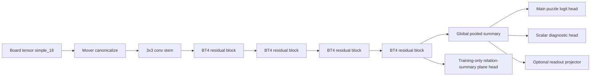

# Fast Distilled Conv Student for Puzzle Classification

Intended filename: `i255_i018_bt4_distillation_student.md`

## Thesis

The best next architecture is not a faster reimplementation of i018’s sheaf machinery. The repo already tested that path with i249, and it failed on both axes that matter: it was slower than i018 and lost accuracy. The repo also tested a BT4 primitive-mixer line, and none of the successful runs beat the plain BT4 conv baseline. The highest-value path is therefore a **BT4-shaped conv student that stays dense-convolutional at inference time, but is trained with richer supervision from i018 than logits alone**. That supervision should include calibrated teacher logits, a compact set of scalar tactical diagnostics, a typed relation-density target, and a small set of spatial relation-summary planes. That design preserves the CPU-friendly kernel pattern of BT4 while transferring the part of i018 that appears to be genuinely load-bearing: its chess geometry. fileciteturn12file0L3-L3 fileciteturn13file0L3-L3 fileciteturn21file0L3-L3

That recommendation is grounded in the repo’s current frontier. In the paper-grade trunk comparison, i018 keeps scaling and reaches about **0.8901 PR-AUC** at `scale_xl`, while the BT4 conv tower plateaus around **0.8589–0.8619**. In the CPU benchmark, the batch-1 per-position latency reported for the BT4 classifier is about **0.83 ms** at base scale, versus **5.28 ms** for i018 base. That is the exact gap this project should attack: recover much more of i018’s decision quality without giving up BT4’s deployment shape. fileciteturn12file0L3-L3 fileciteturn13file0L3-L3

The strongest evidence that richer distillation is warranted is the i018 falsifier. When the model’s typed chess relation masks were scrambled in a degree-preserving way, PR-AUC dropped by roughly **0.0424**, which the repo report itself treats as the cleanest positive result in the whole stack. That strongly suggests the student should learn more than teacher end logits; it should learn a compressed version of the **geometric and tactical summaries** that make i018 work. fileciteturn12file0L3-L3

## Teacher and Student Setup

### Teacher of record

The teacher of record should be **i018 `oriented_tactical_sheaf_laplacian` at `scale_xl`**, because the repo’s paper-grade comparison shows that i018 is the trunk that actually improves with scale and is the top performer in that family. If the checkpoints exist locally, the best offline-teacher variant is a **3-seed scale_xl ensemble averaged at the logit and diagnostic level**, because classical distillation was originally motivated by compressing stronger teachers or teacher ensembles into a smaller deployable network. If the ensemble is inconvenient, use the single best `scale_xl` checkpoint first and reserve the ensemble as an ablation. fileciteturn12file0L3-L3 citeturn4academia0

Architecturally, i018 is well suited as a rich teacher. It canonicalizes the board to the side to move, constructs a **12-type tactical incidence tensor** over the 64 squares, diffuses node states with learned sheaf restriction maps, optionally pools triad defects, and builds its final decision from pooled node features, relation energies, relation densities, gates, triad statistics, and board statistics. It already emits scalar diagnostics such as `sheaf_tension`, `king_ring_pressure`, `defense_gap`, `triad_defect_energy`, and `pin_pressure`, and its implementation computes relation masks and typed relation densities internally. That means the repo already has nearly all the information needed for distillation; what is missing is mostly an export path. fileciteturn16file0L3-L3 fileciteturn22file0L3-L3 fileciteturn23file0L3-L3

The teacher should remain **board-only**. The repo is explicit that CRTK metadata is reporting-only and must not be used as model input. Distillation should follow that rule: `fine_label` and other slice tags may be used in the **loss weighting and reporting**, but not as student features. fileciteturn7file0L3-L3 fileciteturn17file0L3-L3 fileciteturn30file0L3-L3

### Student of record

The student should be a **plain BT4-style residual conv tower**, not a transformer, not a graph block, and not a custom per-relation operator. The current BT4 classifier implementation is exactly that: a 3×3 conv stem, a short sequence of residual 3×3 conv blocks, Squeeze-Excite, dropout, and a light value head. That dense-convolution stack is precisely what maps well to CPU libraries, and the repo’s own postmortem argues that the CPU speed gap exists because BT4 is dense `Conv2d` on a tiny spatial map while i018 spends time in irregular tactical incidence building. fileciteturn18file0L3-L3 fileciteturn13file0L3-L3

There is one important benchmarking nuance. The canonical paper-grade BT4 config in the repo uses `lc0_bt4_112` input planes, but the CPU benchmark script that reports the famous **0.83 ms** number times all models on random `(B, 18, 8, 8)` board-shaped inputs and configures the BT4 classifier with `input_channels: 18`. That makes the 0.83 ms figure a **simple_18 speed reference**, not necessarily the final latency of the 112-plane benchmark model. For this distillation project, that actually argues in favor of a **simple_18 student first**, because it matches the teacher’s encoding, avoids an unnecessary input mismatch, and aligns with the measured fast path. A 112-plane compatibility variant is still worth an ablation because the official BT4 benchmark family uses that encoding. fileciteturn19file0L3-L3 fileciteturn31file0L3-L3

For actual student candidates, I would run exactly two shapes first:

| student | input | channels | blocks | purpose |
|---|---|---:|---:|---|
| `base` | `simple_18` | 64 | 4 | deployment target |
| `scale_up` | `simple_18` | 96 | 6 | quality tier |

Those dimensions are already present in the repo’s CPU benchmark scaling recipe for the BT4 classifier, which makes them directly comparable on latency. fileciteturn31file0L3-L3

## Student Architecture

The core architecture should remain almost embarrassingly plain:

The single most valuable cheap inductive bias to copy from i018 is **mover-oriented canonicalization**. i018’s `BoardStateAdapter` rotates and color-swaps the board so the mover sees their own pieces from the bottom ranks. That is a very strong symmetry reduction, and it is effectively free. I would add a fixed `MoverCanonicalize` preprocessing layer in front of the BT4 stem so the conv student does not have to relearn a symmetry that the teacher bakes in explicitly. fileciteturn16file0L3-L3 fileciteturn22file0L3-L3

After that, keep the trunk almost identical to BT4. The repo has already shown that more exotic BT4 mixer experiments do not help: **0 of 37** successful primitive-mixer runs beat the conv baseline. That is a strong argument for preserving the mature conv tower as the inference backbone and putting innovation into **training-time supervision**, not into slower or more fragile student modules. fileciteturn13file0L3-L3

The student should add two lightweight auxiliary structures. First, a **scalar diagnostic head** attached to the pooled summary vector. That head predicts the required i018 diagnostics and the typed relation-density vector, but it is just a tiny MLP and adds negligible inference cost. Second, a **training-only spatial summary head** attached to the final 8×8 feature map. This head predicts a small set of teacher-derived 8×8 summary planes, not the full 12×64×64 relation tensor. That distinction matters a lot. A full teacher relation tensor has `12 × 64 × 64 = 49,152` floats per sample, or about **192 KB per sample in float32**; on the 360k-example train split that would be about **65.9 GB**. By contrast, **8 summary planes** at 8×8 require only about **2 KB per sample** and about **0.69 GB** for the train split. The compressed target is therefore practical both for caching and for keeping the student fast. fileciteturn22file0L3-L3 fileciteturn23file0L3-L3 citeturn8calculator0turn8calculator1turn9calculator0turn8calculator2turn9calculator1

The eight summary planes I would start with are:

- outgoing `us_attacks_them_piece`
- outgoing `them_attacks_us_piece`
- outgoing `us_defends_us_piece`
- outgoing `them_defends_them_piece`
- outgoing `us_attacks_empty_near_king`
- outgoing `them_attacks_empty_near_king`
- outgoing `king_ray_pin_candidate`
- incoming `king_ray_pin_candidate`

These are cheap projections of teacher relation masks, preserve directionality, and line up with the diagnostics the user explicitly wants. They also avoid reproducing the large relation intermediates that made i249 a failed “fast i018” experiment. fileciteturn21file0L3-L3 fileciteturn13file0L3-L3

I would also add one **optional readout projector** that maps the student’s pooled summary vector into the teacher readout space. This is a compact feature-distillation path, and it is much better matched to the architecture gap than trying to align full hidden maps. i018’s decision is formed from a structured summary vector rather than a conv-like feature stack, so distilling that summary is the right kind of “teacher feature” signal for a conv student. fileciteturn23file0L3-L3 citeturn3academia0turn3academia1

## Distillation Losses and Equations

Plain logit KD is too weak for this setting. Hinton-style softened logits are still the right starting point, but the literature on FitNets, attention transfer, and relational KD all point in the same direction: when teacher and student architectures differ, students usually benefit from **intermediate or structural targets**, not only final soft outputs. That is especially true here because i018’s final logit is the endpoint of a very structured chain involving relations, sheaf energy, triads, and typed readout summaries. citeturn4academia0turn3academia0turn3academia1turn3academia2 fileciteturn23file0L3-L3

Let the teacher provide, for each position \(x\):

- raw logit \(z_t(x)\)
- calibrated soft probability \(p_t(x)=\sigma(z_t/T_t)\)
- scalar diagnostic vector \(d_t(x)\in\mathbb{R}^M\)
- relation-summary planes \(P_t(x)\in\mathbb{R}^{K\times 8\times 8}\)
- optional teacher readout vector \(r_t(x)\)

Let the student output the analogous quantities \(z_s, d_s, P_s, r_s\). Then the recommended loss is:

\[
\mathcal{L}_{sup} = \mathrm{BCEWithLogits}(z_s, y)
\]

\[
\mathcal{L}_{kd} = T_t^2 \,\mathrm{KL}\!\left(\mathrm{Bernoulli}\big(\sigma(z_t/T_t)\big)\,\|\,\mathrm{Bernoulli}\big(\sigma(z_s/T_t)\big)\right)
\]

\[
\mathcal{L}_{diag} = \frac{1}{M}\sum_{m=1}^{M} w_m \,\mathrm{Huber}\!\left(\hat d_{s,m} - \hat d_{t,m}\right)
\]

\[
\mathcal{L}_{plane} = \frac{1}{K}\sum_{k=1}^{K} \mathrm{SmoothL1}\!\left(P_{s,k}, P_{t,k}; \omega_k\right)
\]

\[
\mathcal{L}_{read} = \| W_s r_s - \mathrm{LayerNorm}(r_t)\|_1
\]

\[
\mathcal{L}_{brier} = (\sigma(z_s) - y)^2
\]

and the full objective:

\[
\mathcal{L} =
\lambda_{sup}\mathcal{L}_{sup}
+\lambda_{kd}\mathcal{L}_{kd}
+\lambda_{diag}\mathcal{L}_{diag}
+\lambda_{plane}\mathcal{L}_{plane}
+\lambda_{read}\mathcal{L}_{read}
+\lambda_{brier}\mathcal{L}_{brier}
+\lambda_{rank}\mathcal{L}_{rank}
\]

with \(\mathcal{L}_{rank}\) optional and used only inside hard near-puzzle batches. The softened-logit term follows classic KD, while feature and structure terms follow the rationale of hints, attention transfer, and relational KD. citeturn4academia0turn3academia0turn3academia1turn3academia2

The calibration-aware part should be simple and disciplined. First, fit a single teacher temperature \(T_t\) on the validation split before caching teacher targets. Second, include a small **Brier** term during student training. Third, temperature-scale the student post hoc on validation before final reporting. Temperature scaling is a very strong low-friction calibration baseline, and work on teacher calibration in KD indicates that better-calibrated teacher targets can improve both calibration and student accuracy. citeturn6academia0turn7academia0turn5academia2

The default loss weights I would start with are:

| term | starting weight | note |
|---|---:|---|
| \(\lambda_{sup}\) | 1.00 | supervised anchor |
| \(\lambda_{kd}\) | 0.80 | main soft-target transfer |
| \(\lambda_{diag}\) | 0.25 | scalar tactical supervision |
| \(\lambda_{plane}\) | 0.15 | spatial tactical supervision |
| \(\lambda_{read}\) | 0.10 | compact feature transfer |
| \(\lambda_{brier}\) | 0.05 | calibration-aware regularization |
| \(\lambda_{rank}\) | 0.05 | turn on only after the baseline is stable |

Those are intentionally conservative. The repo already warns, and the KD literature also cautions, that “matching the teacher more” is not automatically the same as better student generalization. The student should remain anchored to the real label objective, not become a pure emulator. citeturn5academia3

### Hard-negative emphasis for near-puzzles

The benchmark goal says the near-puzzle row is the central pressure test, and the trainer already supports losses that use `fine_label` as a **loss-time signal** without making it an input feature. That makes hard-negative emphasis easy to add cleanly. The simplest version is to up-weight BCE on source-class-1 positions by a factor like **1.5–2.0** after a short warm start. A focal-style modulation is also reasonable if you want emphasis to depend on whether the example is already easy for the student. fileciteturn30file0L3-L3 fileciteturn29file0L3-L3 citeturn7academia1

For the optional ranking term, define a hard set \(H\) consisting of puzzles, near-puzzles, and teacher-ambiguous negatives, then use teacher logit orderings inside the batch:

\[
\mathcal{L}_{rank}
=
\frac{1}{|P|}\sum_{(i,j)\in P}
\log\left(1+\exp\left(-s_{ij}(z_s^i-z_s^j)\right)\right),
\qquad
s_{ij}=\mathrm{sign}(z_t^i-z_t^j)
\]

This is a lightweight way to preserve teacher ordering near the decision boundary without introducing any slow student computation. It is also exactly the kind of structural transfer motivated by relational KD. citeturn3academia2

## Diagnostics to Distill and Why

The repo already computes or returns almost everything needed for the six diagnostics that matter here. Some are directly exposed today; others are internal tensors that need a tiny teacher-export hook. The table below reflects what I would make **mandatory** in the first distillation pass. fileciteturn16file0L3-L3 fileciteturn23file0L3-L3

| diagnostic | teacher source | why it matters | student form |
|---|---|---|---|
| **sheaf tension** | current scalar output | best global proxy for i018’s consistency signal | scalar regression |
| **relation density** | current internal `relation_density` vector | tells the student which tactical edge families are active | 12-d vector |
| **king-ring pressure** | current scalar output | cheap transfer of king-safety structure | scalar regression |
| **pin pressure** | current scalar output | direct signal for a high-value tactical motif | scalar regression |
| **defense gap** | current scalar output | likely separator between real tactics and refutable pseudo-tactics | scalar regression |
| **triad defect energy** | current scalar output from triad pool | transfers attacker-target-defender inconsistency | scalar regression |

If budget allows one second-tier cluster, add `transport_imbalance`, `reply_pressure`, and `ray_language_energy`. Those are not the first six I would prioritize, but they are already cheap in the teacher and plausible complements to the required set. fileciteturn23file0L3-L3

The reason to distill these diagnostics is not abstract neatness. The repo’s strongest result says that i018’s relation geometry is load-bearing, and the benchmark reports show that the evaluation needs to care about **pin**, **mate-in-1**, **promotion**, **underpromotion**, **equal-eval positions**, and **hard / very-hard** slices rather than only headline PR-AUC. That is exactly where tactical explanation-style targets help most: they give the student a compressed description of *why* the teacher is sharp or cautious in a position, not only *what* number it emitted at the end. fileciteturn12file0L3-L3 fileciteturn14file0L3-L3 fileciteturn15file0L3-L3

There is one implementation caveat that matters. The current i018 forward returns scalar diagnostics, but it does **not** currently return the typed `relation_density` vector or any spatial summary planes, even though both are computed or trivially derivable during forward. So the first engineering step should be a small teacher-side export mode such as `return_teacher_targets=True`. This is a low-risk extension because the information is already present in the forward path. fileciteturn22file0L3-L3 fileciteturn23file0L3-L3

## Training Protocol

The repo’s benchmark split is already well shaped for this project: **360,000** training examples and **45,000** each for validation and test, balanced across source classes before binary mapping. The benchmark goal is explicit that the near-puzzle class is the central hard-negative pressure test, and it also gives concrete preferred targets for new architectures: reduce near-puzzle false positives while keeping puzzle recall healthy. Distillation should therefore be run on the canonical tagged split and evaluated with the repo’s existing reporting conventions. fileciteturn30file0L3-L3

The protocol I recommend is:

### Teacher calibration and target caching

First, calibrate the teacher on validation with temperature scaling, then export a compact distillation cache for the training split. Each cache row should include:

- teacher raw logit
- teacher calibrated probability
- the six mandatory diagnostics
- the 12-d relation-density vector
- the 8 summary planes
- optionally the teacher readout vector

Do **not** cache the full relation tensor. The storage arithmetic is decisive: full relation tensors would be around **65.9 GB** on the train split in float32, while eight summary planes are only around **0.69 GB**. fileciteturn30file0L3-L3 citeturn9calculator0turn9calculator1

### Student optimization schedule

Because the BT4 conv family already trains stably under the repo’s paper-grade recipe, I would stay close to that recipe rather than importing a transformer-like schedule. Start with the BT4 optimizer defaults and early-stopping machinery that the trainer already uses, then layer in distillation. A clean schedule is:

- **warm start**: 2–3 epochs of supervised BCE plus very light diagnostic loss
- **full distillation**: 10–15 epochs of the full objective
- **hard-negative phase**: enable near-puzzle up-weighting only after the warm start
- **post hoc calibration**: student temperature scaling on validation before final reporting

That is deliberately simple. The repo already has a cautionary example showing how architecture conclusions can be confounded by bad training recipes, especially for the transformer line. This project does not need that kind of recipe risk; the student should inherit the stable conv training path and change as little else as possible. fileciteturn19file0L3-L3 fileciteturn12file0L3-L3 fileciteturn29file0L3-L3

### CPU latency target

The latency target should be measured with the repo’s existing CPU benchmark methodology: CPU-only, eager mode, no `torch.compile`, warmup plus timed forward passes, and batch sizes **1, 8, 32**. The key decision metric is batch-1 per-position latency, because the repo explicitly notes that this is the realistic chess-engine number. fileciteturn31file0L3-L3 fileciteturn13file0L3-L3

My target would be:

| student tier | batch-1 target | rationale |
|---|---:|---|
| **base accept** | **≤ 1.2 ms** | stays close to BT4’s 0.83 ms while remaining >4× faster than i018 base |
| **base stretch** | **≤ 1.0 ms** | nearly preserves the BT4 deployment advantage |
| **scale_up accept** | **≤ 1.6 ms** | quality tier that still beats i018 by a large CPU margin |

Those thresholds are intentionally relative to the repo’s measured BT4 and i018 reference points. If the final student is run in a 112-plane input regime instead of `simple_18`, remeasure and treat the above as **relative targets**, not absolute promises. fileciteturn13file0L3-L3 fileciteturn19file0L3-L3 fileciteturn31file0L3-L3

## Metrics, Slice Reports, and Ablations

The benchmark goal is very clear that PR-AUC alone is not enough. The important rates are near-puzzle false positives, puzzle recall, binary F1, and PR-AUC, with accuracy only as supporting context. The repo already produces a per-class benchmark report and a matched-recall false-positive report, so the student should be promoted only if it looks better **across that whole evaluation surface**, not just on a headline score. fileciteturn30file0L3-L3 fileciteturn14file0L3-L3 fileciteturn15file0L3-L3

The mandatory metric bundle should contain:

| category | report |
|---|---|
| headline quality | PR-AUC, F1, recall, precision, ROC-AUC |
| hard-negative quality | near-puzzle FP rate at recall 0.80 and 0.85 |
| calibration | NLL, Brier, ECE after temperature scaling |
| speed | CPU latency and throughput at batch 1 / 8 / 32 |
| slices | difficulty, phase, eval bucket, tactic motif, to-move |

Temperature scaling, ECE, NLL, and Brier are standard calibration checks and fit naturally with the proposed calibration-aware training and post-hoc scaling. citeturn6academia0turn5academia2

For slice reports, I would explicitly highlight the slices that the repo already flags as important or difficult:

- `equal` eval bucket
- `hard` and `very_hard`
- `mate_in_1`
- `promotion` and `underpromotion`
- `pin`

That is not arbitrary. In the repo’s reports, i018’s weak or stress slices include **equal**, **hard**, **very_hard**, **mate_in_1**, and **promotion**, while the tactic-motif tables show that pin and promotion-family motifs are useful discriminators across architectures. If the student narrows the overall teacher gap but collapses on those slices, it has not actually solved the benchmark. fileciteturn14file0L3-L3 fileciteturn15file0L3-L3

The ablation ladder should be short and ruthless:

| ablation | question |
|---|---|
| supervised BT4 only | what is the real non-distilled baseline? |
| + calibrated logit KD | how much does plain KD buy by itself? |
| + scalar diagnostics | do explanation-style scalar targets reduce the teacher gap? |
| + 12-d relation density | does typed tactical mass help beyond scalars? |
| + summary planes | does spatial teacher structure help enough to justify the head? |
| + readout matching | is compact feature KD useful or unnecessary? |
| + near-puzzle emphasis | does it cut matched-recall false positives? |
| canonicalization on/off | is the teacher’s mover orientation a cheap win? |
| base vs scale_up | where is the best latency-quality Pareto point? |
| `simple_18` vs `lc0_bt4_112` | is benchmark comparability worth the input overhead? |

That ladder is ordered on purpose. It first answers whether richer-than-logit supervision helps at all, then asks which added component is actually earning its keep. Distillation projects often fail because the stack adds several clever mechanisms at once and loses attribution. citeturn5academia3

## Failure Modes, Implementation Sketch, and Final Recommendation

### Failure modes

The most obvious failure mode is **diagnostic mimicry without decision gain**. The student may learn to predict teacher diagnostics nicely while the main logit barely improves. That is why the supervised term should stay dominant and why slice metrics must remain the real promotion gate. Richer teacher matching is useful only if it improves near-puzzle rejection and slice faithfulness on the real task. citeturn5academia3

The second failure mode is **teacher blind-spot inheritance**. i018 is strong overall, but the repo’s slice reports show stress points on equal positions, hard / very-hard difficulty, mate-in-1, and promotion-family motifs. A distilled student can inherit those weak spots cleanly. If that happens, the first response should be **slice-aware hard-negative weighting**, not a more exotic student. Only after that would I consider a future multi-teacher ablation with slice specialists such as i024 or i193. fileciteturn14file0L3-L3 fileciteturn15file0L3-L3

The third failure mode is **over-smoothing** from too much temperature or too much KD weight. That can improve calibration while quietly hurting puzzle recall. This is exactly why the project should report both calibration metrics and matched-recall false-positive tables, and why post-hoc student temperature scaling should be separated from the core supervised objective. citeturn6academia0turn7academia0turn7academia2

The fourth failure mode is **latency erosion from training-only ideas leaking into inference**. Summary planes, readout projectors, and any teacher-export logic must remain optional and cheap. The repo’s i249 and BT4-mixer postmortems are already a warning against bolting extra machinery onto a path whose main value is speed. fileciteturn13file0L3-L3 fileciteturn21file0L3-L3

### Implementation sketch

This fits the current repo structure cleanly. The README already centers `src/chess_nn_playground/models/`, `ideas/`, `configs/`, `scripts/`, and the shared trainer stack as canonical extension points. The trainer already accepts **dict outputs**, extracts a `logits` field, serializes scalar diagnostic tensors into prediction artifacts, and supports custom loss names, custom schedulers, and `fine_label`-aware losses. That means the plumbing cost is modest. fileciteturn7file0L3-L3 fileciteturn28file0L3-L3 fileciteturn29file0L3-L3

I would implement it in six pieces:

1. **New idea registry folder**  
   `ideas/registry/i255_i018_bt4_distillation_student/`  
   with `architecture.md`, `config.yaml`, `model.py`, and `trainer_notes.md`.

2. **New student model**  
   `src/chess_nn_playground/models/trunk/bt4_distill_student.py`  
   containing:
   - mover canonicalization
   - BT4 trunk
   - main logit head
   - scalar diagnostic head
   - optional summary-plane head
   - optional readout projector

3. **Teacher export hook**  
   extend `src/chess_nn_playground/models/trunk/oriented_tactical_sheaf.py` with a flag such as `return_teacher_targets` so the model can optionally return:
   - `relation_density_vec`
   - `summary_planes`
   - `teacher_readout`

4. **Teacher-cache script**  
   `scripts/cache_i018_teacher_targets.py`  
   that runs the frozen teacher over the canonical splits, fits teacher temperature on validation, and writes compact Parquet sidecars.

5. **New loss path**  
   add `I018BT4DistillationLoss` to the training loss stack and a new trainer branch such as  
   `training.loss: i018_bt4_distill`.

6. **Benchmark configs**  
   create at least:
   - `base_simple18`
   - `scale_up_simple18`
   - optional `base_lc0_bt4_112`

Because the trainer already writes scalar output columns into prediction artifacts, the new student diagnostics will automatically flow into evaluation reports once they are exposed as per-sample scalars. That is exactly the right implementation shape for this repo. fileciteturn29file0L3-L3

### Final recommendation

Build **one plain conv student**, not a family of exotic students. The recommended architecture is:

- **input**: `simple_18`
- **preprocess**: fixed mover-oriented canonicalization
- **trunk**: BT4 residual conv tower
- **output heads**:
  - one main puzzle logit
  - one scalar diagnostic head for the six required diagnostics plus a 12-d typed relation-density vector
  - one training-only 8-plane relation-summary head
  - one optional readout projector

Train it with **supervised BCE + calibrated logit KD + scalar diagnostic distillation + summary-plane distillation**, and only then test whether readout matching or pairwise hard-negative ranking add further value. Do **not** start with plain logit-only KD, do **not** distill the full 12×64×64 relation tensor, and do **not** add slow student modules that give back the CPU advantage you are trying to preserve. fileciteturn13file0L3-L3 fileciteturn21file0L3-L3

The concrete promotion gate I would use is:

| gate | base target | scale_up target |
|---|---:|---:|
| PR-AUC | **≥ 0.875** | **≥ 0.880** |
| near-puzzle FP @ recall 0.80 | **≤ 0.16** | **≤ 0.155** |
| puzzle recall | **≥ 0.80** | **≥ 0.80** |
| batch-1 CPU latency | **≤ 1.2 ms** | **≤ 1.6 ms** |

Those goals are consistent with the repo’s benchmark priorities, strong enough to matter, and still realistic relative to the current i018 and BT4 reference points. If the `base` student clears them, ship `base`. If `base` stalls on quality but `scale_up` still lands under the latency cap, ship `scale_up`. In either case, the winning design should be **a fast BT4 conv tower that learns i018’s tactical summaries**, not a slowed-down pseudo-sheaf. fileciteturn30file0L3-L3 fileciteturn12file0L3-L3 fileciteturn13file0L3-L3