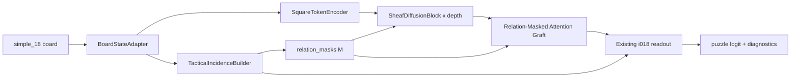

# i258_relation_masked_attention_i018.md

## Thesis and lessons

### Thesis

The right next attention experiment is **not** another generic square-token transformer. It is a **small, relation-masked attention graft inside i018**, using i018’s existing typed relation masks as the neighborhood structure and as additive bias features. The reason to start from i018 is unusually strong: when the repo replaced i018’s real typed chess relation masks with degree-preserving random rewiring, mean test PR-AUC fell from **0.8752** to **0.8328** across three seeds, a **-0.0424** drop. That falsifier says the relation graph is not decorative; it is the mechanism to preserve. Meanwhile, i242’s larger chess-decomposed attention model reached **0.8677** test PR-AUC against its i193 parent at **0.8755**, so the repo already has evidence that a broader attention tower can add cost without beating a strong chess-specific parent. The real transformer benchmark in the repo did even worse, degrading from **0.7571** at 4.8M parameters to **0.5875** at 25.4M, and the accompanying report explicitly attributes much of that collapse to a CNN-style training recipe rather than to attention as a universal dead end. fileciteturn42file0L3-L3 fileciteturn37file0L3-L3 fileciteturn46file0L3-L3

The proposal, then, is to keep the **i018 sheaf/diffusion trunk as the backbone**, and add one **post-sheaf sparse attention residual block** that only attends over chess-relevant neighbors defined by i018’s relation tensors. That keeps the proven chess geometry, avoids a full new tower, and turns attention into a **local enhancer of already relation-aware square states** instead of a replacement architecture. This is also more consistent with the repo’s smaller sparse-attention precedents: p007 is an additive attack-ray sparse-attention head on top of i193, and p008 is a rule-conditioned sparse operator over a legal-edge adjacency, both designed as narrow side branches rather than full global-transformer replacements. fileciteturn43file0L3-L3 fileciteturn44file0L3-L3

### Lessons from i242 and transformer failure

The clearest lesson from i242 is **“keep the chess decomposition, but make attention narrower.”** In the repo’s i242 ablation summary, the full model used **270,791** parameters and scored **0.8677** test PR-AUC; the conv-only i193 parent used **157,348** parameters and scored **0.8755**. The i242 ablations are revealing: removing the global stream dropped i242 to **0.8621**, removing chess bias to **0.8624**, removing the exchange stream to **0.8529**, and switching to i193 hyperparameters still only reached **0.8661**. The exchange path was therefore the single most load-bearing part of the design, while global attention and chess-biased attention each contributed only partial recovery inside a model that still did not surpass its parent. That points away from a new full attention tower and toward a **small attention block attached to the strongest existing relation-aware path**. fileciteturn37file0L3-L3

The transformer benchmark teaches a different but complementary lesson: **bad negative evidence should be localized to the failed recipe, not over-generalized to all attention.** The repo’s authentic encoder-only transformer ran at base / scale_up / scale_xl sizes of **4.8M / 12.5M / 25.4M** parameters and degraded with scale from **0.7571** to **0.6402** to **0.5875** test PR-AUC. The report states that this run used a CNN-style recipe—no warmup, plateau scheduling, and a fixed LR that was too hot for the larger models—and explicitly recommends warmup + cosine + stronger transformer-style regularization for a fair retry. The repo’s later knowledge update also notes that the current benchmark split is only **173,029 train / 21,305 val / 21,501 test** positions, while the converted corpus contains **45,002,737** rows, so attention failure here may be as much a **data and schedule** issue as an architectural one. That is exactly why i258 should evaluate **chess-constrained attention under a matched i018 recipe**, not attempt to settle the general transformer question again. fileciteturn46file0L3-L3 fileciteturn39file0L3-L3

A third lesson comes from the repo’s successful and partially successful small-operator experiments. The experiment report says the primitive scout’s top cluster should be treated as a coarse filter because single-seed differences of about **0.005 PR-AUC** are noise, but it is still useful that **p007_attack_ray_sparse_attention** landed in the competitive top group at **0.8764** in that scout. More importantly, p007’s architecture uses a **fixed small neighborhood of 9 slots per source square**, and p008 uses a **stop-gradient legal-edge graph** with only a few recurrence steps, both explicitly designed to stay near the parent model’s cost budget. That is the right operational scale for the next attention attempt in this repo. fileciteturn45file0L3-L3 fileciteturn43file0L3-L3 fileciteturn44file0L3-L3

## Equations and architecture

### Attention equations with relation masks and biases

The base attention form should remain the standard scaled dot-product rule from the Transformer, but with two graph-style constraints layered on top: **masked neighborhoods** and **relation-dependent additive bias**. That is a natural synthesis of the original Transformer equation, Shaw et al.’s relation-aware biasing, GAT-style masked neighborhood attention, and Graphormer’s conclusion that structural encodings are what make transformer blocks work well on graph-structured data. citeturn4academia0turn8academia0turn6academia0turn5academia0

Let i018 produce square states \(h \in \mathbb{R}^{B \times 64 \times d}\) with \(d=64\), and typed relation masks
\[
M \in [0,1]^{B \times R \times 64 \times 64}, \quad R=12,
\]
where the 12 relations are the existing i018 attack / defense / king-zone / ray / knight / pawn / pin masks. Those relations already exist in `TacticalIncidenceBuilder`, and i018 already has a built-in `scramble_relations` falsifier path that degree-preservingly randomizes them. fileciteturn12file0L3-L3 fileciteturn30file0L3-L3 fileciteturn31file0L3-L3

Define the per-edge relation signature
\[
r_{uv} = M[:, :, u, v] \in [0,1]^R,
\]
and the union strength
\[
m_{uv} = \max_{r \in \{1,\dots,R\}} M_r(u,v).
\]

The **primary neighborhood selector** is:

\[
\mathcal{N}(u) = \operatorname{TopK}_v\Big(m_{uv} + \lambda_{\text{king}}\,[M_5(u,v)+M_6(u,v)+M_{12}(u,v)]\Big)\ \cup\ \{u\},
\]

where the king-zone boost emphasizes the existing “attacks empty near king” and pin-related relations, and \(K\) is fixed to a small constant such as 8. This turns i018’s dense 64×64 relation tensor into a **fixed-cost sparse neighbor list** without discarding the typed relation information.

For a 2-head, low-width graft with total attention width \(d_a = 24\) and head size \(d_h = 12\),

\[
Q = hW_Q,\quad K = hW_K,\quad V = hW_V,
\]
with \(W_Q, W_K, W_V \in \mathbb{R}^{64 \times 24}\).

The **relation-conditioned bias** is low-rank:

\[
b_{h,uv} = a_h^\top \,\phi(U r_{uv}) + c_h \log(\epsilon + m_{uv}),
\]
where \(U \in \mathbb{R}^{R \times r}\), \(r=4\), \(a_h \in \mathbb{R}^{r}\), \(c_h \in \mathbb{R}\), and \(\phi\) is GELU or tanh.

The masked sparse attention is then

\[
\alpha_{h,uv} =
\operatorname{softmax}_{v \in \mathcal{N}(u)}
\left(
\frac{q_{h,u}^\top k_{h,v}}{\sqrt{d_h}} + b_{h,uv}
\right),
\]

\[
z_u = \big\|_{h=1}^{H} \sum_{v \in \mathcal{N}(u)} \alpha_{h,uv} v_{h,v},
\qquad
\Delta h_u = W_O z_u.
\]

To keep the graft conservative, the update is **gated and residual**:

\[
g_u = \sigma\!\left(w_g^\top [\,h_u \,\|\, \rho_u \,\|\, \kappa_u \,\|\, \pi_u\,]\right),
\]

\[
h'_u = h_u + g_u \,\Delta h_u,
\]

where \(\rho_u\) is local relation density, \(\kappa_u\) is king-zone pressure, and \(\pi_u\) is pin pressure, all already available or derivable from i018’s incidence tensors and diagnostics. The key point is that attention **cannot** create new graph structure here; it can only reweight messages **inside** i018’s existing graph. fileciteturn31file0L3-L3

Three follow-on variants fit inside the same template:

| Variant | Neighborhood definition | Intended use |
|---|---|---|
| Relation-masked primary | Top-K over relation-union score with king boost | Main experiment |
| King-zone-only | Only edges supported by king-zone / pin-related relations | High-precision tactical check / mate refinement |
| Candidate-move | Only pseudo-legal or legal destination squares, optionally from p008-style rule graph | Move-targeted reweighting rather than generic square mixing |

The low-rank bias is shared across all three; only the neighborhood selector changes. The candidate-move version can reuse the same “stop-gradient rule graph” design pattern already used by p008, so it is still a sparse chess-structured operator rather than a fresh global transformer. fileciteturn44file0L3-L3

### Architecture dataflow

The cleanest insertion point is **after the last sheaf diffusion block, before the existing readout**. That placement lets i018 do what it already does well—build typed tactical incidence, diffuse over a learned sheaf Laplacian, and compute relation/triad statistics—before attention refines only the final square states. It also avoids the failure mode of replacing a successful trunk with a speculative tower, which is exactly what the repo’s negative results warn against. fileciteturn30file0L3-L3 fileciteturn31file0L3-L3 fileciteturn37file0L3-L3



A concrete dataflow for the **primary** i258 variant is:

1. Run `BoardStateAdapter` and `TacticalIncidenceBuilder` unchanged.
2. Run the existing i018 `SquareTokenEncoder`.
3. Run the existing `SheafDiffusionBlock` stack unchanged.
4. Build a sparse neighbor list from the already-computed `relation_masks`.
5. Apply **one** relation-masked attention residual update to the 64 square states.
6. Reuse the existing pooled readout and diagnostics, optionally adding a few attention-specific summaries such as mean attention entropy, fraction of edges landing in king-zone neighborhoods, and attention-vs-sheaf agreement.

This is intentionally closer in spirit to p007 and p008 than to i242: a **small side computation attached to a strong parent trunk**, not a parallel tower with its own pooled head and router. fileciteturn43file0L3-L3 fileciteturn44file0L3-L3

## Budget and training

### Parameter and latency budget

Base i018 is a small model by repo standards: scout metadata reports **91,363 parameters** and **9.02M estimated FLOPs per position**, and the current base config uses `channels: 64`, `hidden_dim: 96`, `depth: 2`, and `dropout: 0.1`. The published module shapes in `oriented_tactical_sheaf.py` make it possible to keep a post-sheaf attention graft within essentially the same parameter budget by trimming only the readout hidden dimension. fileciteturn14file0L3-L3 fileciteturn11file0L3-L3 fileciteturn30file0L3-L3 fileciteturn31file0L3-L3

A practical matched-budget proposal is:

| Component | Approx. params |
|---|---:|
| QKV projection, 64 → 24 × 3, bias-free | 4,608 |
| Output projection, 24 → 64, bias-free | 1,536 |
| Relation low-rank projector, 12 → 4 | 48 |
| Per-head relation vectors | 8 |
| Gate, 67 → 1 | 68 |
| LayerNorm | 128 |
| **Attention graft subtotal** | **6,396** |

Then reduce the existing readout head hidden size from **96** to **76**, which removes about **6,360** parameters from the i018 head. Net change is only about **+36 parameters**, which is effectively budget-matched to base i018.

On arithmetic cost, the graft is also small. With 64 squares, \(K=8\), 2 heads, and \(d_a=24\), the added linear layers and sparse edge dot-products contribute only about **0.4–0.5M extra multiply-adds**, roughly **5%** over i018’s published **9.02M** estimate. Because the repo’s CPU benchmark and experiment report show that i018’s latency is dominated more by the irregular relation-building path than by dense linear algebra, this graft should add meaningfully less overhead than a fresh i242-style tower. A realistic expectation is **single-digit arithmetic overhead** and roughly **5–12%** wall-clock slowdown if implemented carefully with fixed \(K\), cached gathers, and no extra dense 64×64×heads attention tensors. That is far more conservative than i242’s move from 157k to 271k parameters, or the 4.8M–25.4M real transformer benchmark. fileciteturn14file0L3-L3 fileciteturn46file0L3-L3 fileciteturn37file0L3-L3

### Training recipe

The training recipe should follow the repo’s **Reliable / Promotion-grade protocol**, not the old habit of treating scout numbers as final evidence. The protocol requires the canonical tagged split, NVIDIA path, matched baselines, validation-only model and threshold selection, and at least a **20-epoch convergence budget** with **min_epochs: 10**, **min_active_epochs: 10**, **early_stopping_patience: 5**, repeated across **seeds 42, 43, 44** for any repo-level best-model claim. It also explicitly requires reporting not just aggregate PR AUC / ROC AUC, but also matched-recall false positives and hard slices such as `hard`, `equal`, `endgame`, `promotion`, and `underpromotion`. fileciteturn47file0L3-L3

For i258 specifically, the safest primary recipe is:

```yaml
seed: 42
deterministic: true
mode: puzzle_binary
device: nvidia

data:
  train_path: data/splits/crtk_sample_3class_unique_crtk_tags/split_train.parquet
  val_path: data/splits/crtk_sample_3class_unique_crtk_tags/split_val.parquet
  test_path: data/splits/crtk_sample_3class_unique_crtk_tags/split_test.parquet
  encoding: simple_18
  cache_features: false

model:
  name: oriented_tactical_sheaf_relation_attention
  input_channels: 18
  channels: 64
  hidden_dim: 76
  depth: 2
  stalk_dim: 8
  dropout: 0.1
  relation_attention:
    enabled: true
    placement: post_sheaf
    num_heads: 2
    attn_dim: 24
    top_k: 8
    relation_rank: 4
    king_boost: 0.5
    zero_init_out: true
    gate_init_bias: -2.0

training:
  reliability_tier: paper_grade
  epochs: 20
  min_epochs: 10
  min_active_epochs: 10
  early_stopping_patience: 5
  batch_size: 256
  learning_rate: 0.0007
  weight_decay: 0.0001
  class_weighting: balanced
  loss: bce_with_logits
  mixed_precision: true
  allow_tf32: true
  matmul_precision: high
  gradient_clip_norm: 1.0
  monitor: pr_auc
  lr_scheduler:
    name: reduce_on_plateau
    factor: 0.5
    patience: 2
    min_lr: 1.0e-05
```

Two details matter here. First, **monitor on `pr_auc`**, because the repo’s reselection audit found that many archived runs would have picked a different best epoch under PR-AUC monitoring, with a mean validation PR-AUC lift of about **+0.005**; if the claim metric is PR AUC, the checkpoint metric should match it. Second, keep the recipe **matched to base i018** for the first comparison. Full-transformer warmup/cosine/AdamW changes should not be introduced only for the candidate, because the repo protocol forbids unmatched schedule tuning in a fairness comparison. If a second pass is needed, apply any warmup or schedule refinement to the baseline and all ablations equally. fileciteturn27file0L3-L3 fileciteturn47file0L3-L3 fileciteturn46file0L3-L3

## Ablations and expected outcome

### Ablations

The core ablation grid should be narrow, directly answer the prompt, and keep parameter count constant except where a deliberately smaller variant is itself the claim.

| Variant | What changes | Why it matters |
|---|---|---|
| No attention | Exact base i018 | Reference point; tests whether any gain is real |
| Global attention | Same tiny graft, but over all 64 squares with no relation mask or relation bias | Tests the “generic global attention” hypothesis directly |
| Random relation masks | Same graft, but run through i018’s degree-preserving `scramble_relations` path before neighborhood selection and bias construction | Tests whether chess geometry matters for attention, not just for sheaf diffusion |
| Relation-masked attention | Primary i258 design | Tests the actual thesis |
| King-zone-only attention | Restrict neighborhoods to king-zone / pin relations | Tests whether the gain is tactical-check/mate-local rather than general |
| Candidate-move attention | Restrict neighborhoods to pseudo-legal or legal target squares | Tests whether “where can this piece actually go?” beats “which squares are tactically related?” |

The four required comparisons from the prompt are the first four rows. The last two are the highest-value follow-ons if the primary relation-masked graft shows even a modest positive signal.

The **expected ranking** is:

\[
\text{relation-masked} \;>\; \text{no attention} \;\gtrsim\; \text{king-zone-only} \;>\; \text{global attention},\ \text{random masks}.
\]

That expectation is not because global attention is inherently bad, but because the repo’s current evidence is specifically against **unconstrained global attention under this budget and recipe**, while the strongest positive evidence in the repo is for **typed tactical relation structure**. fileciteturn42file0L3-L3 fileciteturn37file0L3-L3 fileciteturn46file0L3-L3

### Expected outcome

The realistic target is a **modest base-scale lift**, not a dramatic one. A reasonable expectation is roughly **+0.003 to +0.008 mean test PR-AUC** over base i018 at a matched parameter budget, with the strongest chance of improvement on the repo’s pressure slices—`hard`, `equal`, `promotion`, and `underpromotion`—or on matched-recall near-puzzle FP, rather than on a giant jump in overall ranking. That range is intentionally conservative: i018’s best primitive hybrids added about **+0.006** over base but mostly washed out against parameter-matched i018 scaling, and the primitive scout’s p007 sparse-attention head was competitive but still only single-seed evidence. Any improvement above about **+0.01** at this budget would be surprisingly strong; any result near zero would still be informative if the relation-masked version clearly beats global attention and random masks, because that would show the mechanism direction is right even before scaling. fileciteturn42file0L3-L3 fileciteturn45file0L3-L3 fileciteturn43file0L3-L3

The more important qualitative hypothesis is this:

- If relation-masked attention beats base i018 while global attention does not, then the repo has strong evidence that **attention can help chess evaluation when it is graph-constrained by domain structure**.
- If relation-masked and random-mask versions tie, then the graft is probably just an extra content mixer riding on top of i018 and should not be scaled.
- If global attention wins cleanly, then the repo’s negative i242 / transformer evidence was too pessimistic and the next step should be a larger relation-biased or graph-transformer-style trunk.
- If all four variants tie within seed noise, then attention is probably not the highest-leverage next i018 improvement under the current data regime. fileciteturn45file0L3-L3 fileciteturn47file0L3-L3

## Implementation and decision rule

### Implementation sketch

A minimal PyTorch-style graft can look like this:

```python
class RelationMaskedAttentionGraft(nn.Module):
    def __init__(
        self,
        d_model: int = 64,
        num_heads: int = 2,
        attn_dim: int = 24,
        relation_count: int = 12,
        relation_rank: int = 4,
        top_k: int = 8,
    ) -> None:
        super().__init__()
        assert attn_dim % num_heads == 0
        self.num_heads = num_heads
        self.head_dim = attn_dim // num_heads
        self.top_k = top_k

        self.norm = nn.LayerNorm(d_model)
        self.qkv = nn.Linear(d_model, 3 * attn_dim, bias=False)
        self.out = nn.Linear(attn_dim, d_model, bias=False)

        # Low-rank relation-conditioned bias
        self.rel_proj = nn.Linear(relation_count, relation_rank, bias=False)
        self.rel_head = nn.Parameter(torch.zeros(num_heads, relation_rank))
        self.rel_scale = nn.Parameter(torch.ones(num_heads))

        # Conservative residual gate
        self.gate = nn.Linear(d_model + 3, 1)  # token + density + king + pin
        nn.init.constant_(self.gate.bias, -2.0)

    def forward(
        self,
        h: torch.Tensor,                  # [B, 64, 64]
        relation_masks: torch.Tensor,     # [B, 12, 64, 64]
    ) -> torch.Tensor:
        B, N, D = h.shape
        x = self.norm(h)

        # Union score and king-zone emphasis
        union = relation_masks.amax(dim=1)                               # [B, 64, 64]
        king = relation_masks[:, 4] + relation_masks[:, 5] + relation_masks[:, 11]
        edge_score = union + 0.5 * king

        # Sparse neighborhood: top-k neighbors per source square + self
        topk = edge_score.topk(k=min(self.top_k, N), dim=-1)
        nbr_idx = topk.indices                                           # [B, 64, K]

        # QKV
        qkv = self.qkv(x).view(B, N, 3, self.num_heads, self.head_dim)
        q, k, v = qkv[:, :, 0], qkv[:, :, 1], qkv[:, :, 2]               # [B, 64, H, d_h]

        # Gather neighbor K/V and relation signatures
        idx_exp = nbr_idx.unsqueeze(-1).unsqueeze(-1).expand(-1, -1, -1, self.num_heads, self.head_dim)
        k_nbr = torch.gather(k.unsqueeze(1).expand(-1, N, -1, -1, -1), 2, idx_exp)   # [B, 64, K, H, d_h]
        v_nbr = torch.gather(v.unsqueeze(1).expand(-1, N, -1, -1, -1), 2, idx_exp)

        rel_idx = nbr_idx.unsqueeze(1).expand(-1, relation_masks.size(1), -1, -1)
        rel_sig = torch.gather(relation_masks, 3, rel_idx).permute(0, 2, 3, 1)       # [B, 64, K, 12]

        # Attention logits
        q_src = q.unsqueeze(2)  # [B, 64, 1, H, d_h]
        scores = (q_src * k_nbr).sum(dim=-1) / math.sqrt(self.head_dim)  # [B, 64, K, H]

        rel_latent = torch.gelu(self.rel_proj(rel_sig))                   # [B, 64, K, r]
        rel_bias = torch.einsum("bskr,hr->bskh", rel_latent, self.rel_head)
        rel_bias = rel_bias + self.rel_scale.view(1, 1, 1, -1) * torch.log1p(
            torch.gather(edge_score, 2, nbr_idx).unsqueeze(-1)
        )

        attn = torch.softmax(scores + rel_bias, dim=2)
        msg = (attn.unsqueeze(-1) * v_nbr).sum(dim=2).reshape(B, N, -1)  # [B, 64, attn_dim]
        delta = self.out(msg)

        # Token-local gate
        density = union.mean(dim=-1, keepdim=True)
        king_pressure = king.mean(dim=-1, keepdim=True)
        pin_pressure = relation_masks[:, 11].mean(dim=-1, keepdim=True)
        gate = torch.sigmoid(self.gate(torch.cat([x, density, king_pressure, pin_pressure], dim=-1)))

        return h + gate * delta
```

Integration into i018 is intentionally minimal:

1. Keep `BoardStateAdapter`, `TacticalIncidenceBuilder`, `SquareTokenEncoder`, `SheafDiffusionBlock`, `TriadDefectPool`, and the readout contract intact.
2. Add a `relation_attention_enabled` flag and instantiate one `RelationMaskedAttentionGraft`.
3. In `forward()`, after the sheaf block loop and before readout pooling, run:
   ```python
   if self.relation_attention is not None:
       h = self.relation_attention(h, scrambled_masks)
   ```
4. Add optional diagnostics:
   - mean attention entropy,
   - mean attended king-zone fraction,
   - mean relation bias magnitude,
   - agreement between high-attention edges and high-sheaf-energy relations.

That reuse of `scrambled_masks` is important: it makes the **random relation mask ablation almost free**, because i018 already exposes the right falsifier path in the forward pass. fileciteturn31file0L3-L3

### Go and no-go criteria

The decision rule should be stricter than “best single seed wins.” The repo’s protocol and experiment reports are clear that small single-seed differences are noise and that a new-best claim needs repeated seeds, matched baselines, and hard-slice checks. fileciteturn45file0L3-L3 fileciteturn47file0L3-L3

| Decision axis | Go | No-go |
|---|---|---|
| Aggregate accuracy | Mean test PR-AUC over seeds improves by **≥ 0.003** vs base i018 | Lift < 0.002 or regression |
| Mechanism specificity | Relation-masked beats global attention by **≥ 0.003** and random masks by **≥ 0.010** | Global ties or wins; random-mask ties within 0.01 |
| Hard-slice behavior | No obvious regressions on `hard`, `equal`, `promotion`, `underpromotion` | Any material slice regression without aggregate compensation |
| Matched-recall behavior | Same or better near-puzzle FP at recall 0.80 / 0.85 | Worse on both thresholds |
| Efficiency | Train/inference slowdown stays within **15%** | Slowdown > 20% |
| Stability | Three seeds finish cleanly with no sensitivity spike | High seed variance or unstable optimization |

A practical summary is:

- **Go** if relation-masked attention gives a real, repeatable gain at matched budget and clearly beats both global attention and random-mask controls.
- **Soft go** if aggregate PR-AUC is nearly flat but matched-recall near-puzzle FP or hard-slice PR-AUC improves measurably.
- **No-go** if the gain vanishes under three seeds, if global attention ties the constrained version, or if the constrained version does not materially depend on real relation masks.

The central standard is not “did attention help?” It is **“did chess-constrained attention help because of the chess constraints?”** That is the question i258 should be built to answer.