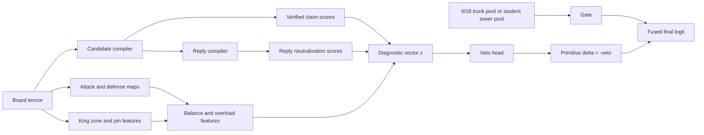

# p049_near_puzzle_hard_negative_primitive

## Thesis and target failure

The repo’s puzzle-binary benchmark is explicitly about separating real puzzles from positions that look similar, especially verified near-puzzles that function as hard negatives. In the canonical label contract, source class `0` and source class `1` both map to binary non-puzzle, while source class `2` maps to puzzle; the benchmark documentation also says the central pressure test is the near-puzzle row, not aggregate accuracy alone. The reliable-training protocol elevates matched-recall false positives at recall `0.80` and `0.85`, along with worst-slice behavior, to paper-grade requirements. In the current matched-recall audit, i018 is already one of the stronger models, but it still leaks near-puzzles at a nontrivial rate: `0.150` near-puzzle FP rate at recall `0.80` and `0.186` at recall `0.85`. That is enough headroom to justify a primitive whose main job is vetoing near-puzzles rather than finding more generic tactical signal. fileciteturn20file0L3-L3 fileciteturn18file0L3-L3 fileciteturn17file0L3-L3

**Thesis.** p049 should be a *rejection primitive*, not a generic tactic booster. Its job is to measure the gap between **surface tactical temptation** and **legally surviving tactical force**. A recent repo research packet already frames the same core hypothesis: near-puzzles often contain a tempting forcing move, but at least one safe reply survives, so the model should score both the positive tactical claim and the opponent’s reply envelope that can veto it. A separate repo primitive packet makes a complementary point: reply structure should be modeled jointly across candidates, because entropy alone can be fooled by one sharp decoy or by diffuse but candidate-dependent reply distributions. p049 should therefore operationalize five kinds of negative evidence at once: legality discount, forcedness gap, candidate concentration, reply availability, and defender-side obligation asymmetry. fileciteturn21file0L3-L3 fileciteturn31file0L3-L3

**Definition of a near-puzzle false positive.** For this repo, a near-puzzle false positive is a sample with `true_fine_label == 1` that the model predicts as puzzle after thresholding at a recall-matched operating point. The existing audit script computes thresholds aimed at target recall, then reports total false positives, near-puzzle false positives, far-negative false positives, and per-slice behavior. For paper-grade reporting, the threshold must be selected on validation only and then frozen for test reporting. Formally, if \(\tau_R\) is the validation-derived threshold that achieves recall target \(R \in \{0.80, 0.85\}\) on true puzzles, then

\[
\operatorname{NearFP}@R
=
\frac{1}{N_{\text{near}}}
\sum_i
\mathbf{1}\!\left[
\text{fine}_i = 1
\;\land\;
\hat y_i(\tau_R)=1
\right].
\]

That is the operational metric p049 should optimize for first, with precision and aggregate PR-AUC treated as secondary constraints rather than the main scoreboard. fileciteturn30file0L3-L3 fileciteturn18file0L3-L3

## Feature equations

Legality is the crucial separator. Under the FIDE Laws of Chess, a side in check must answer the check, and no move is legal if it leaves or exposes that side’s own king to check. The `python-chess` core API exposes both `legal_moves` and `pseudo_legal_moves`; pseudo-legal moves can still leave or put the king in check, while `gives_check()`, `checkers()`, `attackers()`, and `pin()` provide exactly the low-level objects needed to estimate forcing pressure, defender obligations, and king escape structure. One subtle but very useful detail is that raw `attackers()` still counts pinned pieces as attackers. That means attack density and attack maps are *deliberately insufficient* as a puzzle signal; they are perfect inputs for a **surface-pressure** term, but they need a legality-aware correction to become a **verified-force** term. That surface-vs-surviving difference is the center of p049. King-zone attacks, square control, static exchange evaluation, overloading, and safe mobility are well-established engine-side abstractions for compressing tactical geometry into small diagnostic features, so p049 should lean on those rather than raw “how many attacks exist?” counts. citeturn6view0turn6view1turn6view2turn9view2turn9view3turn9view0turn6view3turn6view4turn7view0turn6view6turn6view7turn8view0turn8view2turn8view3

Let \(x\) be the current position, \(s\) the side to move, and \(\bar s\) the defender. Let \(M(x)\) be the legal moves for \(s\), \(x^m\) the board after move \(m\), and \(x^{m,r}\) the board after defender reply \(r\). Let \(A_x(c,q)\) be the number of attackers of color \(c\) on square \(q\), \(Z_x(c)\) the king zone of color \(c\), and \(E_x(c)\) the number of legal king escapes or safe king-zone exits for color \(c\). Let \(T_x(\bar s)\) be the defender-critical target set, defined as the union of the defender king zone, pinned defender pieces, overloaded defender obligations, and hanging or high-value defender pieces.

The candidate set should be narrow and chess-shaped:

\[
C(x)
=
\left\{
m \in M(x):
\mathbf{1}[\text{check}(m)]
+
\mathbf{1}[\text{capture}(m)]
+
\mathbf{1}[\text{promotion}(m)]
+
\mathbf{1}[\Delta KZ(m) > 0]
+
\mathbf{1}[\Delta OVL(m) > 0]
> 0
\right\}.
\]

This keeps the primitive about *verification of tactical temptation*, not about all quiet moves.

For each candidate \(m \in C(x)\), define a **surface claim** and a **verified claim**. The surface claim is allowed to use raw attack maps and pseudo-force; the verified claim must use legal candidate semantics, explicit counterpressure penalties, and defender-reply structure:

\[
u_{\text{surf}}(m)
=
\alpha_1 \,\text{check}(m)
+
\alpha_2 \,\text{SEE}_+(m)
+
\alpha_3 \,\Delta KZ_{\text{raw}}(m)
+
\alpha_4 \,\Delta Bal_{\text{raw}}(m),
\]

\[
u_{\text{ver}}(m)
=
\beta_1 \,\text{check}(m)
+
\beta_2 \,\text{SEE}_+(m)
+
\beta_3 \,\Delta KZ(m)
+
\beta_4 \,\Delta Bal(m)
+
\beta_5 \,\Delta Esc(m)
+
\beta_6 \,\Delta OVL(m)
-
\beta_7 \,Ctr(m).
\]

The terms are:

\[
\Delta KZ(m)
=
\sum_{q \in Z_{x^m}(\bar s)}
w_q \,[A_{x^m}(s,q)-A_{x^m}(\bar s,q)]_+
-
\sum_{q \in Z_x(\bar s)}
w_q \,[A_x(s,q)-A_x(\bar s,q)]_+,
\]

\[
\Delta Bal(m)
=
\sum_{q \in T_{x^m}(\bar s)} v_q \,[A_{x^m}(s,q)-A_{x^m}(\bar s,q)]_+
-
\lambda
\sum_{q \in T_{x^m}(s)} v_q \,[A_{x^m}(\bar s,q)-A_{x^m}(s,q)]_+,
\]

\[
\Delta Esc(m)=E_x(\bar s)-E_{x^m}(\bar s),
\]

\[
Ctr(m)
=
\sum_{q \in Z_{x^m}(s)}
\tilde w_q \,[A_{x^m}(\bar s,q)-A_{x^m}(s,q)]_+.
\]

Now make the legality discount explicit:

\[
Disc(m)=u_{\text{surf}}(m)-u_{\text{ver}}(m).
\]

Near-puzzles should often have large \(Disc(m)\): visually sharp, legally softer.

Next define **candidate move concentration** over verified claims:

\[
\pi_m
=
\frac{\exp(u_{\text{ver}}(m)/\tau_c)}
{\sum_{m' \in C(x)} \exp(u_{\text{ver}}(m')/\tau_c)},
\]

\[
Conc(x)
=
1 - \frac{-\sum_{m \in C(x)} \pi_m \log \pi_m}{\log |C(x)|},
\qquad
Gap_{12}(x)=u_{(1)}-u_{(2)}.
\]

This gives both normalized concentration and a top-two gap. True puzzles often have more concentrated candidate mass than “lots of bright-looking ideas, none verified.”

For each candidate, enumerate legal defender replies \(R(m)=M(x^m)\). Define a **reply neutralization score**:

\[
n(m,r)
=
\gamma_1\,Relief_{KZ}(m,r)
+
\gamma_2\,RestoreEsc(m,r)
+
\gamma_3\,RecoverMat(m,r)
+
\gamma_4\,Save(m,r)
+
\gamma_5\,Counter(m,r),
\]

where

\[
Relief_{KZ}(m,r)
=
\sum_{q \in Z_{x^m}(\bar s)}
w_q
\left(
[A_{x^m}(s,q)-A_{x^m}(\bar s,q)]_+
-
[A_{x^{m,r}}(s,q)-A_{x^{m,r}}(\bar s,q)]_+
\right),
\]

\[
RestoreEsc(m,r)=E_{x^{m,r}}(\bar s)-E_{x^m}(\bar s),
\]

\[
RecoverMat(m,r)
=
\max\!\bigl(0,\; \operatorname{Mat}_{\bar s}(x^{m,r})-\operatorname{Mat}_{\bar s}(x^m)\bigr),
\]

and \(Save(m,r)\) is a binary or soft indicator that the critical attacked defender target is no longer hanging, pinned, or overloaded after the reply.

Aggregate replies with a soft existential operator:

\[
ReplyMass(m)
=
\tau_r \log \sum_{r \in R(m)} \exp\!\bigl(n(m,r)/\tau_r\bigr),
\]

\[
SafeCount(m)=\sum_{r \in R(m)} \mathbf{1}[n(m,r)\ge \kappa],
\]

\[
FG(m)=u_{\text{ver}}(m)-ReplyMass(m).
\]

Then define the primitive’s central forcedness features:

\[
FG^\star(x)=\max_{m \in C(x)} FG(m),
\qquad
m^\star=\arg\max_{m \in C(x)} u_{\text{ver}}(m),
\qquad
Avail(x)=\log(1+SafeCount(m^\star)).
\]

A true puzzle should usually show at least one \(m\) with large positive \(FG(m)\). A near-puzzle false positive should usually show high \(u_{\text{surf}}\), middling or even high \(u_{\text{ver}}\), but also high \(ReplyMass\) or \(Avail\).

To make defender obligation asymmetry explicit, define for each defender piece \(p\):

\[
\Omega_x(p)=\{q \in T_x(\bar s): p \text{ defends } q\},
\]

\[
Obl_x(p)=\sum_{q \in \Omega_x(p)} v_q,
\qquad
SafeMob_x(p)=\text{safe pseudo-legal mobility of } p,
\]

\[
OVL_x(\bar s)
=
\sum_{p \in Pieces_{\bar s}(x)}
\bigl[Obl_x(p)-\eta\,SafeMob_x(p)\bigr]_+
\cdot
\mathbf{1}[|\Omega_x(p)|\ge 2].
\]

Then use

\[
DOA(x)=OVL_x(\bar s)-OVL_x(s).
\]

This turns “defender overload asymmetry” into a compact scalar instead of a vague tactical motif.

One useful optional feature is a reply-channel distinctiveness proxy, inspired by the repo’s reply-channel-capacity primitive. Let

\[
\rho_{m,r}
=
\frac{\exp(n(m,r)/\tau_r)}
{\sum_{r'} \exp(n(m,r')/\tau_r)},
\qquad
\bar \rho = \sum_m \pi_m \rho_{m,\cdot}.
\]

Then define

\[
RCI(x)=H(\bar \rho)-\sum_m \pi_m H(\rho_{m,\cdot}),
\]

where \(H\) is Shannon entropy. \(RCI\) is high when candidate choice genuinely changes the defender-reply distribution, and low when one flashy-looking candidate is mostly a decoy or all candidates induce similar defensive resources. That is exactly the type of discrimination p049 needs. fileciteturn31file0L3-L3

The final diagnostic vector should be

\[
z(x)=
\bigl[
FG^\star,\;
FG(m^\star),\;
Disc(m^\star),\;
Conc,\;
Gap_{12},\;
Avail,\;
RCI,\;
\Delta Bal(m^\star),\;
KEP,\;
DOA,\;
Ctr(m^\star)
\bigr],
\]

with

\[
KEP(x)=\frac{[E_x(\bar s)-E_{x^{m^\star}}(\bar s)]_+}{\max(1,E_x(\bar s))}.
\]

Then use a veto-oriented readout:

\[
veto(x)=\operatorname{softplus}(\operatorname{MLP}(\operatorname{LayerNorm}(z(x)))),
\qquad
\Delta_{p049}(x)=-veto(x).
\]

That last sign choice matters. p049 should be designed so that high values mean “reject this puzzle claim.”

## Integration and implementation

The cleanest first integration point is i018. i018 already canonicalizes the board to side-to-move perspective, builds typed tactical incidence relations over the 64 squares, and emits a tactical diagnostic dictionary that includes quantities such as `reply_pressure`, `defense_gap`, `king_ring_pressure`, and `pin_pressure`; however, those diagnostics are reporting-only and are not used in the loss. i018 also already exposes attack, defense, near-king, ray, knight, pawn, and pin-candidate relations from a board-only input contract. That makes p049 a natural side branch: reuse i018’s canonical piece state, occupancy, and relation tensors, then add a small candidate/reply reducer whose output is a *negative* primitive logit and a compact diagnostic vector. The repo’s existing `oriented_sheaf_plus_primitive` wrapper already fuses a sheaf logit with a primitive logit via a learned scalar gate, so p049 can fit the current training stack without changing trainer APIs. Existing primitives like p006 and p019 are also gated additive side heads initialized near closed, which is the right default for p049. fileciteturn8file0L3-L3 fileciteturn15file0L3-L3 fileciteturn26file0L3-L3 fileciteturn25file0L3-L3

For a student conv tower, late fusion is better than early broadcast. The primitive’s vector \(z(x)\) is global, sparse, and semantically structured; broadcasting it over all 64 squares would make the conv stem relearn a global reduction it does not need. The better design is to concatenate \(z(x)\) to the tower’s pooled representation, or to use \(z(x)\) as a FiLM-style conditioner for the final residual block and classifier head. In both cases, the primitive remains board-only; fine labels and CRTK metadata should remain training-time sampling or evaluation signals, not model inputs. That constraint is consistent with both the benchmark goal and the reliable-training protocol. fileciteturn20file0L3-L3 fileciteturn18file0L3-L3



A prototype implementation can be written quickly against `python-chess` and then moved to the repo’s vectorized rule-table backend once the diagnostic direction is validated. The critical prototype operations already exist as first-class calls: `legal_moves`, `pseudo_legal_moves`, `gives_check()`, `checkers()`, `attackers()`, and `pin()`. The production path should then reuse i018-style attack tables and primitive-side helper modules so that candidate/reply compilation is the only genuinely new work. citeturn6view2turn9view2turn9view3turn9view0turn6view3turn6view4

```python
class NearPuzzleHardNegativePrimitive(nn.Module):
    def __init__(self, n_features: int = 11, hidden_dim: int = 64, dropout: float = 0.1):
        super().__init__()
        self.veto_head = nn.Sequential(
            nn.LayerNorm(n_features),
            nn.Linear(n_features, hidden_dim),
            nn.GELU(),
            nn.Dropout(dropout),
            nn.Linear(hidden_dim, 1),
        )

    def forward(self, x: torch.Tensor, trunk_ctx: torch.Tensor | None = None) -> dict[str, torch.Tensor]:
        # 1) compile legal candidates and legal defender replies
        # 2) compute z = [FG*, FG(m*), Disc(m*), Conc, Gap12, Avail, RCI, Bal, KEP, DOA, Counter]
        z = compute_near_puzzle_diagnostics(x)  # [B, 11]

        # veto-oriented primitive output
        veto = F.softplus(self.veto_head(z)).squeeze(-1)   # larger = stronger rejection
        primitive_logit = -veto                            # additive compatibility with existing hybrids

        out = {
            "logits": primitive_logit,
            "veto_pressure": veto,
            "forcedness_gap": z[:, 0],
            "candidate_concentration": z[:, 3],
            "reply_availability": z[:, 5],
            "reply_channel_information": z[:, 6],
            "attack_defense_balance": z[:, 7],
            "king_escape_pressure": z[:, 8],
            "defender_overload_asymmetry": z[:, 9],
            "counterpressure": z[:, 10],
        }
        return out
```

A compatible i018 hybrid config should follow the existing `oriented_sheaf_plus_primitive` pattern, with `primitive.name: near_puzzle_hard_negative_primitive`, `gate_init: -2.0`, and small defaults such as `top_k_candidates: 24`, `max_replies: 24`, and `head_hidden_dim: 64`. That keeps the first version cheap and honest. fileciteturn6file0L3-L3 fileciteturn15file0L3-L3

## Training and sampling strategy

Use the canonical tagged benchmark split and its label contract unchanged. The repo’s paper-grade protocol is already clear about the split paths, the binary mapping, the `puzzle_binary` task, and the prohibition on using CRTK metadata, source fields, verification flags, or engine outputs as model inputs. p049 should respect that completely. Fine labels may still be used for sampling and evaluation, because the benchmark itself is defined around them; they just must not be fed to the network. fileciteturn18file0L3-L3 fileciteturn20file0L3-L3

The base sampler should stay source-balanced at the batch level, because the canonical split is already balanced by source class. The *p049-specific* change should happen inside the near-negative row. Maintain a replay buffer of the highest-scoring near-puzzle negatives from the parent model or from the last epoch. For every puzzle-positive \(p\) sampled into a batch, mine one near-puzzle \(n\) from that replay buffer that is close in frozen trunk embedding space. That yields “looks similar, but refutable” pairs without using source metadata as an input channel. This is the simplest way to make p049 see the exact mistakes it is supposed to fix.

The loss should remain mostly binary, with only a small pairwise correction:

\[
L
=
L_{\text{BCE}}
+
\lambda_{\text{pair}}
\,[\gamma-(\ell(p)-\ell(n))]_+
+
\lambda_{\text{veto}}
\,[\gamma_v-(v(n)-v(p))]_+,
\]

where \(\ell(\cdot)\) is the final puzzle logit, \(v(\cdot)\) is the primitive veto pressure, \(p\) is a puzzle-positive, and \(n\) is a mined near-puzzle hard negative. The point is not to build a giant multi-objective stack. The point is to keep the main binary task intact while adding a light but targeted ordering pressure: real puzzles should outrank nearby near-puzzles, and near-puzzles should receive larger veto pressure than nearby real puzzles.

Training should happen in two stages. First, freeze the parent trunk for a short stabilization phase and train only p049, the fusion gate, and the final classifier calibration. Then unfreeze only the last parent block plus the fusion gate for the normal convergence budget. That mirrors the repo’s philosophy for primitives: start near-closed, open only if the side branch contributes real complementary signal. The same reliable-training defaults should stay in force: `epochs: 20`, `min_epochs: 10`, `min_active_epochs: 10`, `early_stopping_patience: 5`, balanced class weighting, mixed precision, and paper-grade artifact generation. fileciteturn18file0L3-L3 fileciteturn26file0L3-L3 fileciteturn25file0L3-L3

Checkpoint selection should *not* be based on global PR-AUC alone. The clean validation rule is lexicographic: first minimize validation near-puzzle FP rate at recall `0.80`, then at `0.85`, then preserve precision at those thresholds, and only then use PR-AUC or F1 as a tiebreaker. That follows the repo protocol and directly avoids the failure mode the prompt warns about. fileciteturn18file0L3-L3

## Evaluation and experiment plan

Evaluation must be matched-recall first. Let \(\tau_{0.80}\) and \(\tau_{0.85}\) be the **validation-derived** thresholds that achieve the target recall on true puzzles. Then report on test:

\[
\operatorname{NearFP}@R,\quad
\operatorname{FarFP}@R,\quad
\operatorname{TotalFP}@R,\quad
\operatorname{Precision}@R,
\qquad R \in \{0.80, 0.85\}.
\]

For clarity, also report the gain over the parent:

\[
\Delta \operatorname{NearFP}@R
=
\operatorname{NearFP}_{\text{parent}}@R
-
\operatorname{NearFP}_{\text{p049}}@R.
\]

The repo’s audit script defines the right family of metrics, but for paper-grade use the threshold must come from validation, not from the same split being scored. That distinction should be explicit in the p049 report. fileciteturn30file0L3-L3 fileciteturn18file0L3-L3

The current audit also shows which slices matter most: equal-eval positions, hard and very-hard rows, mate-in-1 near-puzzles, and promotion or underpromotion slices all appear as recurrent pressure points for strong models including i018. p049 should therefore be evaluated not only on aggregate matched-recall FP but also on those slices. A primitive that lowers aggregate near-FP but regresses badly on equal/hard/promotion is not solving the operational problem. fileciteturn17file0L3-L3

The experiment plan should be staged.

- **Smoke prototype.** Implement the candidate/reply compiler with `python-chess` on a small FEN batch and verify directional sanity: true puzzles should have higher \(FG^\star\) and lower \(Avail\) than near-puzzles on average. Also verify that `Disc` is larger for visually sharp but refutable examples. citeturn6view2turn9view3turn6view3turn6view4

- **Scout integration with i018.** Compare `i018`, `i018 + p049(full)`, `i018 + concentration-only`, `i018 + no-reply`, and `i018 + no-overload`. This is the fastest way to test whether the primitive is actually rejecting near-puzzles and not just reweighting generic tactics. The existing i018 hybrid wrapper is already in place for this kind of experiment. fileciteturn15file0L3-L3

- **Reliable run.** Train seeds `42`, `43`, and `44` on the canonical split with the normal convergence budget. Use the current matched-recall audit numbers for i018 as the parent reference, and keep i011, i191, i192, and i013 as supporting external references for “reply-aware” and “rejective” behavior. fileciteturn17file0L3-L3

- **Transfer check on a student conv tower.** Add the same primitive to a lighter conv student. If the gain survives there, p049 is a real board-level hard-negative primitive rather than an i018-specific side effect.

- **Ablation set.** Run at least these controls: no legality discount, no reply mass, no reply-channel information, no king-escape pressure, no overload asymmetry, shuffled replies, and far-negative-only replay mining. If the full model wins only because of broad conservatism, one of these controls will expose it.

The success bar should be stricter than “slightly better PR-AUC.” The repo’s promotion rule already says that a meaningful win can be a matched-recall near-puzzle FP reduction with similar or better precision. For p049 specifically, I would treat a **3–5% relative reduction** in near-puzzle FP at both recall points, with no more than a very small PR-AUC regression and no equal/hard/promotion slice collapse, as a convincing first success. The reason to use a stricter bar than the repo minimum is that i018 is already a strong parent; a tiny win here is less credible than a clear operating-point improvement. fileciteturn18file0L3-L3 fileciteturn17file0L3-L3

## Falsifiers and failure modes

**Falsifiers.** The thesis behind p049 is wrong, or at least overstated, if any of the following happen.

- Removing reply features leaves performance unchanged. Then the “safe-reply envelope” story is not load-bearing. fileciteturn21file0L3-L3
- Shuffling defender replies while preserving reply counts and local marginals leaves performance unchanged. Then reply geometry is not the signal.
- A concentration-only or legality-discount-only ablation matches the full model. Then the primitive is simpler than claimed, and the full candidate/reply machinery is not justified.
- Near-puzzle FP rate falls only because the model becomes broadly conservative, with comparable drops in far-negative FP and a meaningful precision or recall cost. Then p049 is a threshold-smoother, not a near-puzzle diagnostic.
- Gains disappear when thresholds are selected by the validation-only matched-recall protocol, or disappear on equal/hard/promotion slices. Then the primitive is not solving the operational benchmark problem as defined by the repo. fileciteturn18file0L3-L3 fileciteturn17file0L3-L3

**Failure modes.** The most likely failure modes are structural, not bookkeeping.

- **Multi-solution puzzles.** Some real puzzles have several winning candidates. A high concentration prior can over-veto them.
- **Deep tactical puzzles.** One-ply reply neutralization can overestimate defender resources in positions where the attacker wins anyway after the “safe” reply.
- **Sacrificial puzzles with many legal but losing replies.** Legal reply count is not the same thing as genuinely safe reply mass. This is why \(ReplyMass\) should be weighted by neutralization quality, not by raw reply count.
- **Quiet or endgame puzzles.** Some true puzzles have low king-zone pressure and low attack density but still contain decisive zugzwang, geometry, or conversion motifs. p049 may underhelp there.
- **Promotion and underpromotion.** These are already known pressure slices. If the candidate compiler does not carry explicit promotion-lane features, it will miss exactly the cases the benchmark cares about most. fileciteturn17file0L3-L3
- **Pinned-attacker inflation.** Because raw attack maps can count pinned pieces as attackers, a naïve implementation can reintroduce the very “tactical-looking” false-positive behavior p049 is supposed to remove. The legality discount is not optional; it is central. citeturn6view3turn6view4turn6view0

The bottom line is straightforward: p049 should be a **board-only veto primitive** whose main signal is “verified force minus safe reply mass,” with candidate concentration, legality discount, king escape pressure, attack-defense imbalance, and defender overload asymmetry as companion diagnostics. That is much closer to the repo’s operational failure mode than any primitive that simply measures “more tactics,” and it fits naturally into the existing i018 hybrid contract as a small negative side head rather than a new trunk. fileciteturn20file0L3-L3 fileciteturn15file0L3-L3